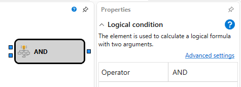

# Logical Condition

Este elemento é usado para calcular uma fórmula lógica com dois argumentos.

## Sockets de entrada

- **Flag** - o valor da flag (caracteriza o estado e tem dois valores: levantada (true) e baixada (false)).
- **Flag** - o valor da flag (caracteriza o estado e tem dois valores: levantada (true) e baixada (false)).

## Sockets de saída

- **Flag** - o valor da flag (caracteriza o estado e tem dois valores: levantada (true) e baixada (false)).

## Parâmetros

- **Operator** - um conjunto predefinido de fórmulas lógicas AND, OR, Exclusive OR.

## Ver também

[Formula](formula.md)
