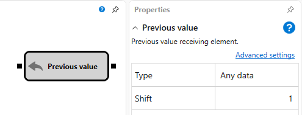

# Valor anterior

O cubo é usado para obter o valor anterior passado para a entrada, com o deslocamento especificado.

## Sockets de entrada

- **Any data** - um determinado tipo de dados recebido e passado.

## Sockets de saída

- **Any data** - um determinado tipo de dados recebido e passado, introduzido na entrada com o deslocamento especificado nos parâmetros.

## Parâmetros

- **Data type** - o tipo de dados que pode ser introduzido através do socket de entrada. Se alterar este parâmetro, o tipo de dados dos parâmetros é automaticamente alterado.
- **Offset** - o tamanho do deslocamento, isto é, por quantas alterações o valor de saída ficará atrasado em relação ao de entrada.

## Conteúdo recomendado

[Valor aleatório](random.md)
