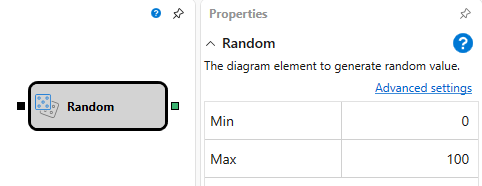

# Valor aleatório

Este bloco é usado para gerar um valor aleatório.

## Sockets de entrada

- **Acionador** - o sinal (qualquer valor exceto `False`) que determina o momento em que é necessário passar um valor aleatório gerado através do socket de saída.

## Sockets de saída

- **Valor** - um valor aleatório.

## Parâmetros

- **Mín** - o limite mínimo permitido do valor.
- **Máx** - o limite máximo permitido do valor.

## Ver também

[Estratégia de P&L](pnl_strategy.md)
