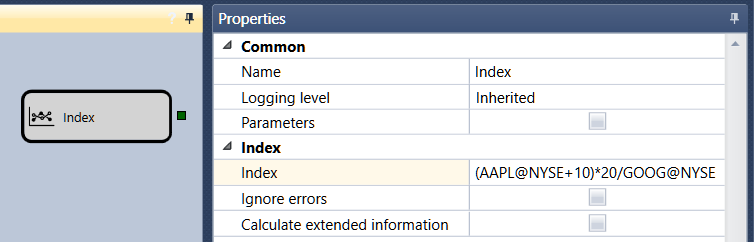

# Índice

O cubo é usado para criar o seu próprio índice. 

### Conectores de saída

Conectores de saída

- **Instrumento** - o índice calculado, representado como um **instrumento**.

### Parâmetros

Parâmetros

- **Índice** - a fórmula matemática de uma combinação de vários instrumentos (por exemplo, (AAPL@NASDAQ+10)\*(abs(20\/GOOG@NYSE)).
- **Ignorar erros** - o sinalizador definido indica que os erros serão ignorados ao calcular o índice.
- **Calcular informação alargada** - o sinalizador definido indica que, ao calcular o índice, além da informação básica (Volume total, Preço de abertura, Preço de fecho, Preço máximo, Preço mínimo), será calculada a informação alargada (Volume financeiro total das transações, Volume de abertura, Volume de fecho, Volume máximo, Volume mínimo).

As fórmulas matemáticas disponíveis são semelhantes às do cubo [Fórmula](../common/formula.md).

## Conteúdo recomendado

[Variável](variable.md)
