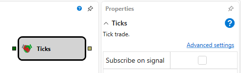

# Ticks

Este bloco é usado para receber dados **Tick** de um instrumento.

### Sockets de entrada

Sockets de entrada

- **Instrument** - o instrumento para o qual é necessário receber dados **Level1**.

### Sockets de saída

Sockets de saída

- **Tick** - uma transação tick.

### Parâmetros

Parâmetros

- **Subscribe on Signal** - subscrever dados apenas depois de chegar um trigger.

## Ver também

[Index](index.md)
