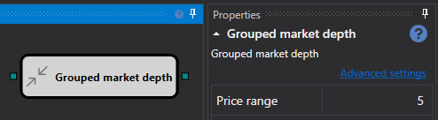
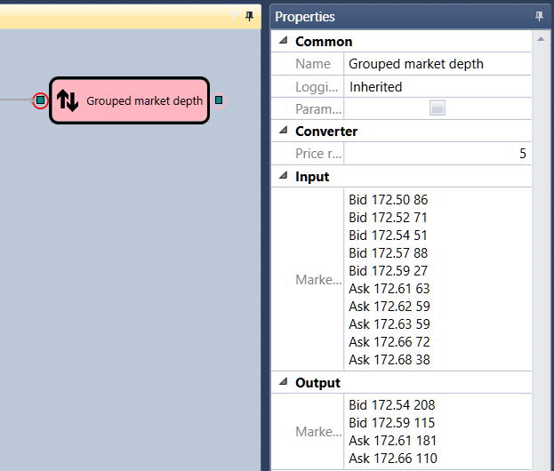

# Livro de ofertas agrupado

O cubo é usado para obter um livro de ordens agrupado.

### Conectores de entrada

- **Livro de ofertas** - o livro de ordens a agrupar.

### Conectores de saída

- **Livro de ofertas** - o livro de ordens agrupado.

### Parâmetros

- **Intervalo de preços** - o intervalo de preços em que as ordens serão agrupadas.

## Conteúdo recomendado

[Livro de ofertas esparso](sparse_order_book.md)
