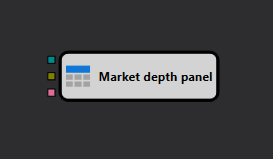

# Painel de livro de ofertas

O cubo foi concebido para apresentar o livro de ordens num componente gráfico especializado [Livro de ordens](../../../../user_interface/components/order_book.md).

O componente [Livro de ordens](../../../../user_interface/components/order_book.md) deve ser adicionado a partir do grupo [Componentes](../../../../user_interface/components.md) dos separadores **Simulação** ou **Negociação**. Pode encontrar mais detalhes sobre o componente [Livro de ordens](../../../../user_interface/components/order_book.md) na secção [Livro de ordens](../../../../user_interface/components/order_book.md).

### Sockets de entrada

- **Livro de ofertas** - o livro de ordens que tem de ser apresentado.
- **Ordem** - uma ordem, cujo volume tem de ser apresentado na coluna *Own Volume*.
- **Erro de ordem** - um erro no registo ou cancelamento de uma ordem, para o qual é necessário mostrar uma animação.

## Ver também

[Livro de ofertas agrupado](grouped_order_book.md)
