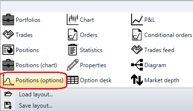

# Gráfico de posições

O cubo é usado para apresentar o **Chart of options positions**.

Para apresentar o **Chart of options positions**, é necessário adicionar o componente gráfico **Chart of options positions**.

### Sockets de entrada

Sockets de entrada

- **Model** - o modelo de cálculo (por exemplo, Black-Scholes).
- **Price of the underlying asset** - o preço do ativo subjacente.

## Conteúdo recomendado

[Black Scholes](black_scholes.md)
