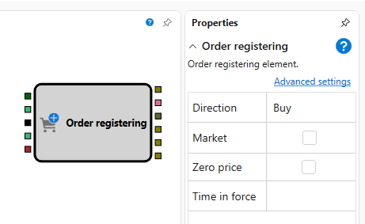
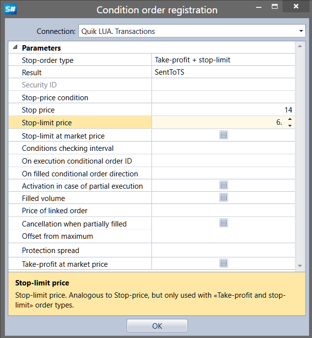

# Registo de ordem

O componente "Registo de ordem" é utilizado para colocar ordens de negociação para um instrumento seleccionado.

## Sockets de entrada

- **Instrumento** - O instrumento seleccionado para a ordem.
- **Preço** - Especifica o preço de uma ordem limitada.
- **Acionador** - Sinal de activação da ordem; aceita qualquer valor excepto `False`.
- **Volume** - A quantidade de instrumentos para a ordem.
- **Carteira** - A carteira no âmbito da qual a ordem será colocada.

## Sockets de saída

- **Ordem** - Informação sobre a ordem colocada.
- **Erro** - Informação sobre qualquer erro durante o registo da ordem.
- **Transação** - Informação sobre a transacção efectuada na ordem.
- **Cancelamento** - Sinal de que a ordem foi cancelada.
- **Executado** - Sinal de que a ordem foi totalmente executada.
- **Concluído** - Sinal que combina eventos de erro, cancelamento ou execução total da ordem.

## Parâmetros

- **Direção** - Determina se a ordem é de compra ou de venda.
- **Ordem de mercado** - Indica se a ordem é uma ordem de mercado.
- **Preço zero** - Se o preço for definido como zero, a ordem é registada como ordem de mercado.
- **Validade** - A duração durante a qual uma ordem limitada permanece activa.

## Configuração de ordem condicional

**Ordem condicional** - Uma ordem com condições adicionais que determinam o momento de colocação no sistema de negociação com base na situação actual do mercado.

- **Ligação** - A ligação onde a ordem será colocada.
- **Tipo de ordem stop** - O tipo de ordem stop.
- **Resultado** - O resultado da ordem stop executada.
- **Identificador do instrumento** - O identificador do instrumento para ordens stop com condições relacionadas com outro instrumento.
- **Condição de preço stop** - A condição do preço stop. Utilizada para ordens como "preço stop para outro instrumento".
- **Preço stop** - O preço stop que define a condição de activação da ordem stop.
- **Preço stop-limit** - Semelhante ao preço stop, mas utilizado apenas para ordens do tipo "take-profit e stop-limit".
- **Stop-limit ao preço de mercado** - Indica se a ordem "Stop-Limit" é executada ao preço de mercado.
- **Intervalo de verificação da condição** - O intervalo de tempo para verificar as condições da ordem apenas dentro do período especificado (se for nulo, não há verificações). Utilizado para os tipos "take-profit e stop-limit" e "take-profit e stop-limit por ordem".
- **Identificador de execução da ordem condicional** - O identificador da ordem condicional baseada na execução.
- **Direção da ordem condicional por execução** - A direcção da ordem condicional baseada na execução.
- **Ativação em execução parcial** - A execução parcial da ordem é considerada. Uma ordem "por execução" será activada após a execução parcial da ordem de condição.
- **Volume executado** - Usa o volume executado da ordem como quantidade para colocar a ordem stop. A quantidade de títulos numa ordem "por execução" é tomada como o volume executado da ordem de condição.
- **Preço da ordem ligada** - O preço da ordem limitada ligada.
- **Retirada em execução parcial** - Indica a retirada da ordem stop após a execução parcial da ordem limitada ligada.
- **Desvio do máximo** - O valor de desvio face ao preço máximo (mínimo) da última transacção.
- **Spread de proteção** - O tamanho do spread de protecção.
- **Take-profit ao preço de mercado** - Indica se a ordem "Take-Profit" é executada ao preço de mercado.

## Nota

Trabalhar com ordens é um método de baixo nível para gerir posições. Para uma gestão de nível superior, recomenda-se utilizar o componente "Modificar posição", descrito em [Modificar posição](../positions/modify.md).

## Ver também

[Modificar posição](../positions/modify.md)
