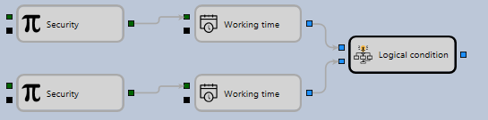

# Tempo de trabalho

Este bloco é utilizado para determinar o tempo de trabalho da estratégia. Por exemplo, para definir quando ocorre negociação para um instrumento específico ou quando a estratégia tem permissão para negociar.
#### Sockets de entrada

- **Quaisquer dados** - o bloco aceita qualquer valor, mas usa a respectiva marca temporal, que depois é comparada com os parâmetros do bloco.
#### Sockets de saída

- **Sinalizador** - uma flag que determina se a marca temporal cumpre os parâmetros do bloco (true) ou não (false).
#### Parâmetros

- **Hora inicial** - a hora de início do tempo de trabalho.
- **Hora final** - a hora de fim do tempo de trabalho.

O bloco pode ser utilizado para determinar quando a negociação é realizada para vários instrumentos de diferentes plataformas de negociação.

## Ver também

[A negociação é permitida](trade_allow.md)
