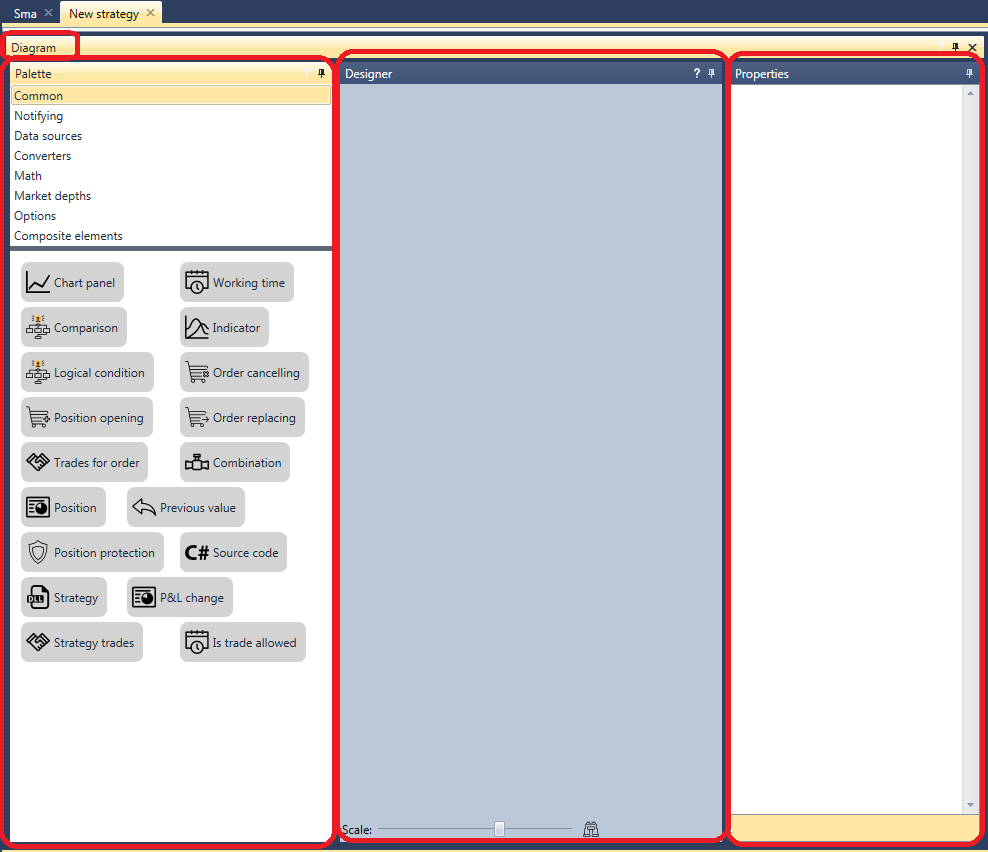
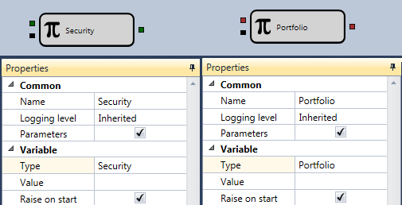
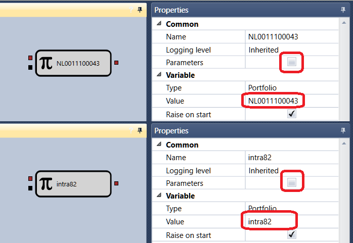
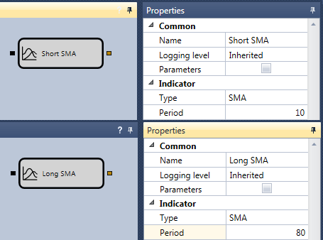
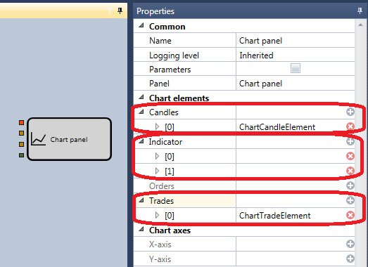
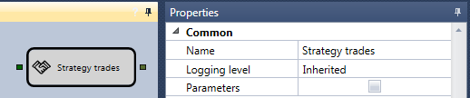
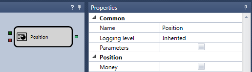

# Primeira estratégia

Para criar esquemas de estratégias e elementos compostos, e para testar as estratégias obtidas em dados históricos, pode utilizar um exemplo da estratégia de média móvel (SMA). Este exemplo permite percorrer um ciclo completo desde a criação da estratégia até ao seu teste e depuração. A estratégia de média móvel (SMA) pode ser encontrada na pasta **Estratégias** do painel **Esquemas**.

1. Criar uma nova estratégia a partir dos cubos, conforme descrito em [Utilização de código](../using_code.md). Para adicionar uma nova estratégia, clique no botão **Adicionar**  no separador **Geral** e seleccione **Estratégia**. Em alternativa, clique com o botão direito do rato na pasta **Estratégia** no painel **Esquemas** e clique no botão **Adicionar**  no menu pendente.

Depois de clicar no botão **Adicionar**  na pasta **Estratégia** do painel **Esquemas**, aparecerá uma nova estratégia. Na área de trabalho, aparece um novo separador com uma estratégia; ao mudar para ele, o separador **Emulação** será aberto automaticamente na faixa de opções. No separador **Emulação**, pode alterar o nome da estratégia e atribuir-lhe uma breve descrição.

2. Para trabalhar de forma conveniente, abra e fixe os painéis **Paleta** e **Propriedades** da área **Esquemas** clicando no botão . O resultado é uma janela do seguinte tipo.

3. A essência da estratégia de média móvel (SMA) é a seguinte:

- Existem duas médias móveis com períodos de cálculo diferentes, uma SMA longa e uma SMA curta. No exemplo, o cubo [Indicador](elements/common/indicator.md) da SMA longa chama-se **SMA longo**, com um período de 80 velas, e a SMA curta chama-se **SMA curto**, com um período de 10 velas.
- Quando uma média móvel curta cruza uma longa de baixo para cima, abre-se uma posição longa.
- Quando uma média móvel curta cruza uma longa de cima para baixo, abre-se uma posição curta.
- Se existir uma posição oposta no momento em que é recebido um sinal para abrir uma posição, inverte-se a posição.

4. Para todas as estratégias, são necessários um instrumento e uma carteira, que serão utilizados para as negociações. Deve adicioná-los do painel **Paleta** ao painel **Designer**. No exemplo, o cubo [Variável](elements/data_sources/variable.md) com o tipo **Instrumento** chama-se **Instrumento**, e o cubo [Variável](elements/data_sources/variable.md) com o tipo **Carteira** chama-se **Carteira**. Defina a caixa de verificação **Parâmetros** dos cubos **Instrumento** e **Carteira**. Quando a caixa de verificação está seleccionada, o cubo obtém o valor a partir das definições da estratégia. Se não seleccionar a caixa de verificação, deve introduzir manualmente os valores do instrumento e da carteira. Se deixar o campo **Valor** do cubo [Variável](elements/data_sources/variable.md) vazio e não definir a caixa de verificação dos parâmetros, durante o teste a estratégia emitirá um erro relativo ao valor não definido do cubo [Variável](elements/data_sources/variable.md).

Se precisar de utilizar vários instrumentos ou carteiras na estratégia, então, para cada cubo, deve desmarcar a caixa **Parâmetros** e definir o valor do instrumento ou da carteira.

5. Depois de adicionar o instrumento e a carteira, deve adicionar dois cubos [Indicador](elements/common/indicator.md), seleccionar o tipo SMA, nomear o primeiro **SMA longo**, definir o período de 80 velas, nomear o segundo **SMA curto** e definir o período de 10 velas.

6. Para que os indicadores funcionem, passe-lhes uma série de velas. Para isso, crie o cubo [Velas](elements/data_sources/candles.md). No exemplo, são utilizadas apenas velas formadas com um período de 5 minutos.

7. Depois de adicionar os indicadores, precisa de adicionar dois cubos que definem os cruzamentos dos indicadores. Estes são os cubos [Cruzamento](elements/common/crossing.md) dos elementos compostos. O primeiro cubo chama-se **Cruzamento ascendente**. Define o cruzamento de baixo para cima. O indicador **SMA curto** é passado para a entrada superior do cubo, e o indicador **SMA longo** para a entrada inferior. O operador CurrComparison é definido para um valor maior, e o operador PrevComparison é definido para menor ou igual. O segundo cubo chama-se **Cruzamento descendente**; define o cruzamento de cima para baixo. O indicador **SMA curto** é passado para a entrada superior do cubo, e o indicador **SMA longo** para a entrada inferior. O operador CurrComparison é definido para um valor menor, e o operador PrevComparison é definido para maior ou igual.

8. Adicione o [Gráfico](elements/common/chart.md) para apresentar visualmente velas, indicadores e negociações. Adicione elementos de apresentação para velas, dois indicadores e negociações ao [Gráfico](elements/common/chart.md).

9. Como origem das negociações para apresentação no gráfico, é utilizado o cubo **Negócios** da estratégia. No exemplo, chama-se **Negócios por estratégia**.

10. Para abrir uma posição, adicione dois cubos [Registo de ordem](elements/orders/register.md). O primeiro cubo destina-se à compra por ordem de mercado. São passados para a entrada deste cubo: o **Instrumento**, o sinal para abrir uma posição proveniente do cubo de cruzamento **Cruzamento ascendente**, a **Carteira** e o volume da ordem. O segundo cubo destina-se à venda por ordem de mercado. São passados para a entrada deste cubo: o **Instrumento**, o sinal para abrir uma posição proveniente do cubo de cruzamento **Cruzamento descendente**, a **Carteira** e o volume da ordem.

11. Ao ligar os elementos acima com linhas ([Linhas](lines.md)), obtém-se um esquema sem ter em conta a posição actual da estratégia. Nessa condição, acumulará uma quantidade excessiva de lotes.

Para controlar a posição, precisa de adicionar o cubo [Posição](elements/positions/current.md), para cuja entrada são passados **Instrumento** e **Carteira**.

Para processar a posição actual, pode utilizar o esquema pronto descrito em [Obter posição actual](schema_samples/get_current_position.md). Este esquema determina o valor efectivo do volume de ordem necessário. Se a posição tiver de ser invertida, devolve o dobro do valor da carteira.

12. Como resultado, a estratégia concluída fica assim:

## Conteúdo recomendado

[Elementos compostos](composite_elements.md)
