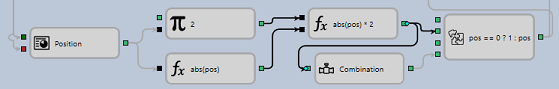

# Linhas

A estratégia no designer é um esquema de um conjunto de elementos e ligações entre eles. Cada ligação vai do parâmetro de saída de um cubo para o parâmetro de entrada de outro cubo. Normalmente, todas as linhas de ligação são coloridas a cinzento, mas quando aponta para o cubo ao qual pertencem, as linhas ficam pretas.

Cada ligação pode ser realçada apontando para ela e clicando com o botão esquerdo do rato. A ligação seleccionada será marcada com círculos nas extremidades da linha; ao agarrá-los, pode redireccionar a linha. Se premir a tecla Del na linha seleccionada, esta será eliminada.

Pode ligar entre si parâmetros das mesmas cores (os mesmos tipos de dados), excepto os seguintes tipos de parâmetros:

- O parâmetro **preto** pode aceitar quaisquer dados. Na maioria das vezes, estes parâmetros são utilizados para passar sinais para quaisquer acções dentro do elemento. Por exemplo, o elemento [Variável](elements/data_sources/variable.md) armazena um valor e, quando recebe um sinal, passa o valor para a saída.
- O parâmetro **verde** pode aceitar diferentes tipos de dados comparados. Por exemplo, valores numéricos, valores de indicadores, cadeias de caracteres, etc.

## Conteúdo recomendado

[Modelo de eventos](event_model.md)
