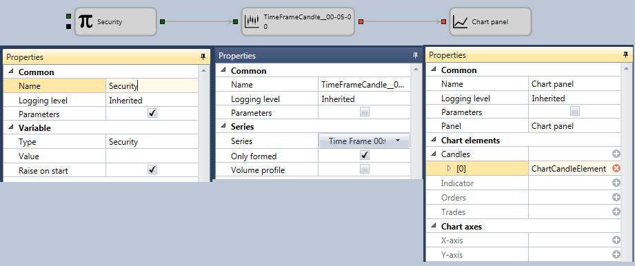

# Apresentar velas no gráfico

Para enviar velas de um instrumento para um gráfico, pode ser utilizado o seguinte esquema:

Para o cubo [Variável](../elements/data_sources/variable.md), é seleccionado o tipo de dados **Instrumento**. Se o instrumento não for especificado, mas a flag **Parâmetros** do grupo de propriedades **Geral** estiver definida, este será retirado da estratégia e passado para o cubo [Velas](../elements/data_sources/candles.md). Para o cubo [Velas](../elements/data_sources/candles.md), são especificadas as definições para construir velas de 5 minutos e passar apenas velas totalmente formadas.

Para o cubo [Gráfico](../elements/common/chart.md), foi adicionado um elemento gráfico com tipo de vela, para o qual o parâmetro de entrada foi adicionado automaticamente.

Depois de adicionar os elementos gráficos necessários ao painel do gráfico, é adicionada a ligação dos elementos [Velas](../elements/data_sources/candles.md) e [Gráfico](../elements/common/chart.md), através da qual as velas construídas serão passadas para apresentação no gráfico.

## Conteúdo recomendado

[Obter o melhor preço para o instrumento](get_best_price_for_instrument.md)
