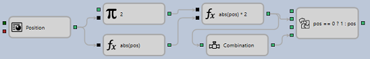

# Obter posição actual

Para obter o volume necessário para inverter a posição actual para a posição oposta, pode ser utilizado o esquema do exemplo da estratégia SMA:

O tipo de dados **Instrumento** é seleccionado para o cubo [Variável](../elements/data_sources/variable.md). Se o instrumento não for especificado, mas a flag **Parâmetros** do grupo **Geral** estiver definida, então será retirado da estratégia e depois passado para [Posição](../elements/positions/current.md).

Para o cubo [Posição](../elements/positions/current.md), a propriedade da posição também não é especificada, mas a flag **Parâmetros** do grupo **Geral** está definida, o que significa que a posição será obtida para a carteira especificada nas definições da estratégia.

Depois de passar o instrumento e alterar a posição, utilizando a função matemática com um argumento (abs(pos)), é calculado o valor absoluto e é dado um sinal ao cubo de variável (2). Este cubo contém um factor de 2, para passar o valor armazenado através do parâmetro de saída, após o que, utilizando uma fórmula matemática com dois argumentos (abs(pos) \* 2), é calculado o seu produto. Em seguida, utilizando o cubo composto Conditional operator (pos \=\= 0 ? 1 : pos), é determinado o valor efectivo do volume necessário, que pode diferir do valor da posição actual multiplicado por 2. Por exemplo, no momento de início da estratégia, quando ainda não foram executadas ordens. Neste caso, o elemento Conditional statement devolve um valor predefinido de 1. Como um parâmetro de saída só pode ser ligado uma vez ao parâmetro de entrada de outro elemento, para passar o mesmo valor entre a fórmula e o operador condicional, é adicionado um cubo **Combinação** adicional.

## Conteúdo recomendado

[Obter nível de preço do livro de ordens](get_order_book_price_level.md)
