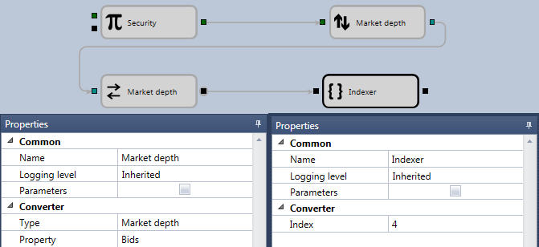

# Obter nível de preço do livro de ordens

Para obter a linha de compra necessária do livro de ordens, pode ser utilizado o seguinte esquema:

O tipo de dados **Instrument** é seleccionado para o cubo [Variável](../elements/data_sources/variable.md). Se o instrumento não for especificado, mas a flag **Parameters** do grupo de propriedades **Common** estiver definida, então será retirado da estratégia. Para o cubo [Converter](../elements/converters/converter.md), são seleccionados o tipo de dados e o campo correspondente da colecção de cubos para a compra Bids. O cubo indexador obtém o elemento necessário da colecção dos melhores preços de compra. Para obter um determinado valor de preço ou volume num nível, pode utilizar o cubo [Converter](../elements/converters/converter.md).

## Conteúdo recomendado

[Galeria](../../../strategy_gallery.md)
