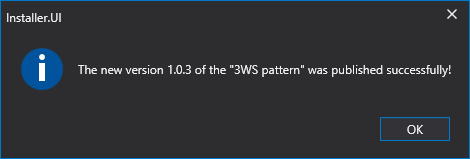

# Publicar a sua estratégia

Pode publicar a sua estratégia clicando na estratégia com o botão esquerdo do rato no painel [Schemes](../user_interface/schemas.md) e seleccionando **Publish**:

Depois de clicar no botão **Publish**, será aberta uma janela com a escolha do tipo de exportação. Para mais detalhes, consulte a secção [Exportar estratégias](../export_import/export.md).

Depois de escolher o tipo de exportação, o programa [Installer](../../installer.md) é activado com os parâmetros de publicação ([Installer](../../installer.md) deve ser iniciado antecipadamente):

Campos que devem ser preenchidos:

- Name
- Description
- Nuget package identifier. Este parâmetro é necessário para definir a ligação para o produto na loja. Por exemplo, no endereço https://stocksharp.com/store/runner/, a palavra **runner** é especificada através deste parâmetro.

O acesso ao nível **Free** ou **Paid** só é concedido após contacto por email [info@stocksharp.com](mailto:info@stocksharp.com). Por predefinição, está disponível o nível **Private**, que permite publicar estratégias apenas em formato privado (para utilizadores seleccionados):

Depois de clicar no botão **Save**, a estratégia será enviada para o servidor StockSharp.

Ao publicar actualizações, não é necessário introduzir novamente todos os parâmetros. Em vez de introduzir os parâmetros do produto, aparecerá uma janela para introduzir uma nota para a actualização:

Depois de clicar no botão **OK**, aparecerá uma janela a indicar uma actualização bem-sucedida:

