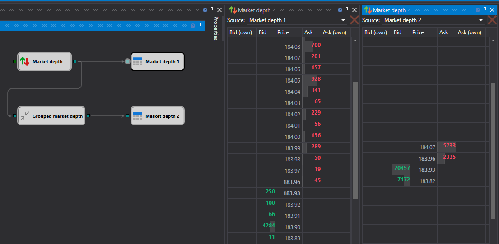

# Livro de ordens

O componente **Order book** é uma tabela de ordens limitadas de compra e venda. Na parte superior do componente, deve seleccionar a origem de dados a partir da qual os dados serão recebidos. A origem dos dados é o cubo [Order Book Panel](../../strategies/using_visual_designer/elements/market_depths/order_book_panel.md). 

Na estratégia, pode utilizar vários tipos diferentes de livros de ordens (ou de diferentes instrumentos) em simultâneo e apresentá-los em diferentes painéis. 

## Conteúdo recomendado

[Posições](positions.md)
