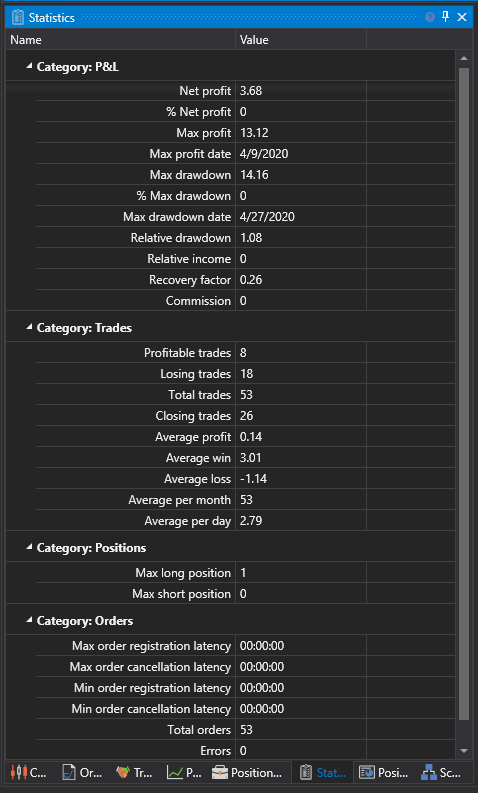

# Estatísticas

O componente **Estatísticas** é uma tabela agrupada por categorias: P/L, negócios, posições, ordens. As estatísticas ajudam a avaliar a correção e o desempenho da estratégia. Por exemplo, a estratégia de exemplo SMA não pode ter mais do que 1 posição. As estatísticas também ajudam a avaliar o desempenho da estratégia por outros parâmetros qualitativos, como drawdown máximo, drawdown relativo, fator de recuperação, etc.

## Ver Também

[Depuração](../../backtesting/debugging.md)
