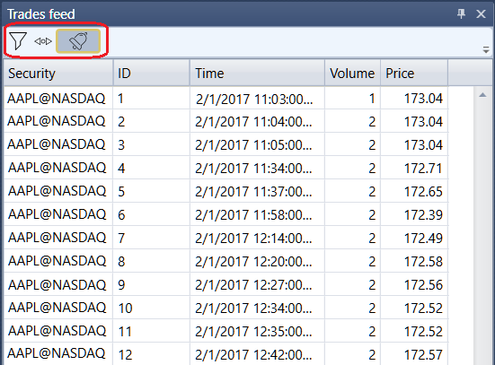

# Negócios tick

O componente **Fluxo de negócios** é uma tabela de negócios que apresenta informações completas sobre todos os negócios dos instrumentos selecionados.

O **Fluxo de negócios** tem um filtro para selecionar os instrumentos necessários. Também pode configurar notificações para eventos relacionados com os instrumentos selecionados na janela [Definições de notificação](../../../terminal/notifications.md).

