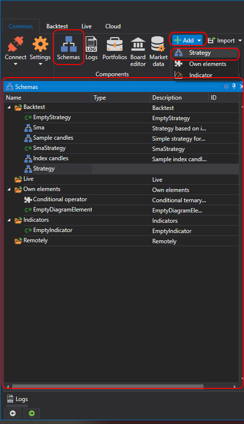

# Painel de esquemas

Para abrir o painel **Esquemas**, tem de clicar no botão **Esquemas** no separador **Comum**. O painel **Esquemas** contém uma árvore de scripts, agrupados em pastas por finalidade. Os esquemas de estratégias e os blocos personalizados não são diferentes. São editados com um editor comum, [Designer de estratégias](../strategies/using_visual_designer/diagram_panel.md). No entanto, para evitar confusão entre eles, estão divididos em duas listas independentes e guardados em pastas diferentes (estratégias na pasta **Teste histórico**, blocos personalizados na pasta **Blocos personalizados**). A seleção de um esquema para edição é feita com duplo clique no item necessário na lista. O esquema selecionado será então aberto no designer para visualização e edição. Abaixo encontra-se uma descrição das pastas no painel **Esquemas**:

1. A pasta **Teste histórico** contém estratégias de negociação criadas tanto como esquemas a partir de um conjunto de elementos e ligações entre eles, como a partir de código. Pode adicionar uma nova estratégia premindo o botão **Adicionar**  no separador **Geral** e selecionando **Estratégia**. Ou clicando com o botão direito do rato na pasta **Teste histórico** no painel **Esquemas** e premindo o botão **Adicionar**  no menu pendente. Na janela que se abre, selecione exatamente como pretende criar uma estratégia.

    

    As estratégias podem ser criadas usando um designer visual sem programação ou usando o editor de código-fonte integrado. Além disso, podem ser ligados ficheiros DLL externos com estratégias escritas no Microsoft Visual Studio. As informações detalhadas sobre **Estratégias** são descritas na secção [Usar blocos](../strategies/using_visual_designer.md).

2. A pasta **Elementos próprios** contém elementos que representam uma funcionalidade completa e podem ser usados em vários esquemas ou num esquema várias vezes com valores de propriedades diferentes. Esses conjuntos de elementos podem ser extraídos para um bloco separado, que será depois usado como qualquer elemento padrão. **Bloco personalizado** é um esquema normal que é guardado/carregado/editado como qualquer esquema de estratégia. Adicione um novo elemento composto premindo o botão **Adicionar**  no separador **Geral** e selecionando **Blocos personalizados**. Ou clicando com o botão direito do rato na pasta **Blocos personalizados** no painel **Esquemas** e premindo o botão **Adicionar**  no menu pendente. Ao adicionar novos blocos personalizados, estes são adicionados automaticamente à **Paleta de elementos**, no grupo **Blocos personalizados**, e podem ser usados na criação de outros esquemas de estratégias e blocos personalizados. As informações detalhadas sobre **Blocos personalizados** são descritas na secção [Creating composite elements](../strategies/using_visual_designer/composite_elements.md).

3. A pasta **Ao vivo** contém estratégias adicionadas para negociação. As estratégias iniciadas são marcadas com o ícone , e as que estão paradas são marcadas com o ícone . A forma de adicionar estratégias à pasta **Ao vivo** e de as iniciar é descrita na secção [Live trading](../live_execution/getting_started.md).

4. A pasta **Indicadores** contém os seus próprios indicadores para estratégias de negociação, escritos por si. Não é possível criar novos indicadores com esquemas; apenas estão disponíveis código e ficheiros DLL externos. O uso de indicadores personalizados em esquemas está disponível através do bloco [Indicador](../strategies/using_visual_designer/elements/common/indicator.md) ao selecionar o tipo de indicador.

5. A pasta **Remoto** contém estratégias localizadas num servidor remoto.

## Ver Também

[Painel Logs](logs.md)
