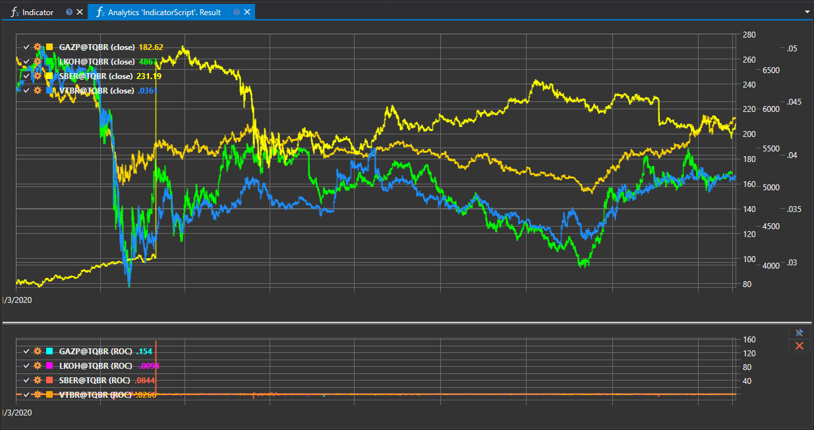

# Indicadores

O script "Indicador" destina-se a demonstrar o trabalho com indicadores de análise técnica na plataforma StockSharp. Permite aos utilizadores carregar dados históricos, aplicar-lhes vários indicadores e apresentar os resultados num gráfico. Esta abordagem ajuda na análise das tendências do mercado e na tomada de decisões de negociação informadas.



## Capacidades Funcionais

O script fornece a seguinte funcionalidade:

- **Carregamento de dados históricos**: Selecionar instrumentos financeiros de interesse e carregar os respetivos dados históricos para um período especificado.
- **Aplicação de indicadores**: Aplicar um ou mais indicadores de análise técnica aos dados carregados.
- **Visualização**: Apresentar dados e resultados da análise usando indicadores num gráfico, proporcionando uma visão clara da dinâmica do mercado.

## Exemplos de Indicadores

O script pode trabalhar com uma ampla gama de indicadores, incluindo, entre outros:

- **Médias Móveis (MA)**: Representam o preço médio ao longo de um determinado período, ajudando a identificar tendências.
- **Relative Strength Index (RSI)**: Avalia a magnitude e a velocidade das alterações de preço, ajudando a identificar condições de sobrecompra ou sobrevenda.
- **Bandas de Bollinger (BB)**: Mostram o intervalo e a volatilidade dos preços, com base em médias móveis e desvios-padrão.

## Aplicação em Negociação e Análise

A utilização de indicadores de análise técnica através deste script permite:

- **Identificar tendências**: Detetar a direção de movimento do mercado para planear estratégias de entrada e saída.
- **Identificar pontos de inversão**: Determinar momentos em que a tendência do mercado pode mudar de direção.
- **Analisar volatilidade**: Avaliar o nível de instabilidade dos preços para adaptar estratégias às condições de mercado.

## Implementação no Script

Para trabalhar com o script, é necessário executar os seguintes passos:

1. **Selecionar um instrumento e período**: Determinar os instrumentos e o intervalo temporal para análise.
2. **Aplicar indicadores**: Escolher e definir parâmetros para os indicadores a aplicar aos dados.
3. **Apresentar resultados**: Visualizar dados históricos e indicadores num gráfico para análise.

O script "Indicador" fornece uma ferramenta poderosa para análise aprofundada dos mercados financeiros, permitindo que traders e analistas usem estes indicadores para desenvolver estratégias de negociação eficazes.

## Código do Script em C#

```cs
namespace StockSharp.Algo.Analytics
{
	/// <summary>
	/// O script analítico, usa o indicador ROC.
	/// </summary>
	public class IndicatorScript : IAnalyticsScript
	{
		Task IAnalyticsScript.Run(ILogReceiver logs, IAnalyticsPanel panel, SecurityId[] securities, DateTime from, DateTime to, IStorageRegistry storage, IMarketDataDrive drive, StorageFormats format, DataType dataType, CancellationToken cancellationToken)
		{
			if (securities.Length == 0)
			{
				logs.LogWarning("Sem instrumentos.");
				return Task.CompletedTask;
			}

			// criar 2 painéis para candles e séries de indicadores
			var candleChart = panel.CreateChart<DateTimeOffset, decimal>();
			var indicatorChart = panel.CreateChart<DateTimeOffset, decimal>();

			foreach (var security in securities)
			{
				// parar o cálculo se o utilizador cancelar a execução do script
				if (cancellationToken.IsCancellationRequested)
					break;

				var candlesSeries = new Dictionary<DateTimeOffset, decimal>();
				var indicatorSeries = new Dictionary<DateTimeOffset, decimal>();

				// criar ROC
				var roc = new RateOfChange();

				// obter o armazenamento de candles
				var candleStorage = storage.GetCandleMessageStorage(security, dataType, drive, format);

				foreach (var candle in candleStorage.Load(from, to))
				{
					// preencher séries
					candlesSeries[candle.OpenTime] = candle.ClosePrice;
					indicatorSeries[candle.OpenTime] = roc.Process(candle).ToDecimal();
				}

				// desenhar séries no gráfico
				candleChart.Append($"{security} (fecho)", candlesSeries.Keys, candlesSeries.Values);
				indicatorChart.Append($"{security} (ROC)", indicatorSeries.Keys, indicatorSeries.Values);
			}

			return Task.CompletedTask;
		}
	}
}

```

## Código do Script em Python

```python
import clr

# Adicionar referências .NET
clr.AddReference("StockSharp.Messages")
clr.AddReference("StockSharp.Algo.Analytics")
clr.AddReference("Ecng.Drawing")

from Ecng.Drawing import DrawStyles
from System.Threading.Tasks import Task
from StockSharp.Algo.Analytics import IAnalyticsScript
from StockSharp.Algo.Indicators import ROC
from storage_extensions import *
from candle_extensions import *
from chart_extensions import *
from indicator_extensions import *

# O script analítico, usa o indicador ROC.
class indicator_script(IAnalyticsScript):
	def Run(self, logs, panel, securities, from_date, to_date, storage, drive, format, data_type, cancellation_token):
		if not securities:
			logs.LogWarning("Sem instrumentos.")
			return Task.CompletedTask

		# criar 2 painéis para candles e séries de indicadores
		candle_chart = create_chart(panel, datetime, float)
		indicator_chart = create_chart(panel, datetime, float)

		if data_type is None:
			logs.LogWarning(f"Tipo de dados não suportado {data_type}.")
			return Task.CompletedTask

		message_type = data_type.MessageType

		for security in securities:
			# parar o cálculo se o utilizador cancelar a execução do script
			if cancellation_token.IsCancellationRequested:
				break

			candles_series = {}
			indicator_series = {}

			# criar ROC
			roc = ROC()

			# obter o armazenamento de candles
			candle_storage = get_candle_storage(storage, security, data_type, drive, format)

			for candle in load_range(candle_storage, message_type, from_date, to_date):
				# preencher séries
				candles_series[candle.OpenTime] = candle.ClosePrice
				indicator_series[candle.OpenTime] = to_decimal(process_candle(roc, candle))

			# desenhar séries no gráfico
			candle_chart.Append(
				f"{security} (fecho)",
				list(candles_series.keys()),
				list(candles_series.values())
			)
			indicator_chart.Append(
				f"{security} (ROC)",
				list(indicator_series.keys()),
				list(indicator_series.values())
			)

		return Task.CompletedTask

```
