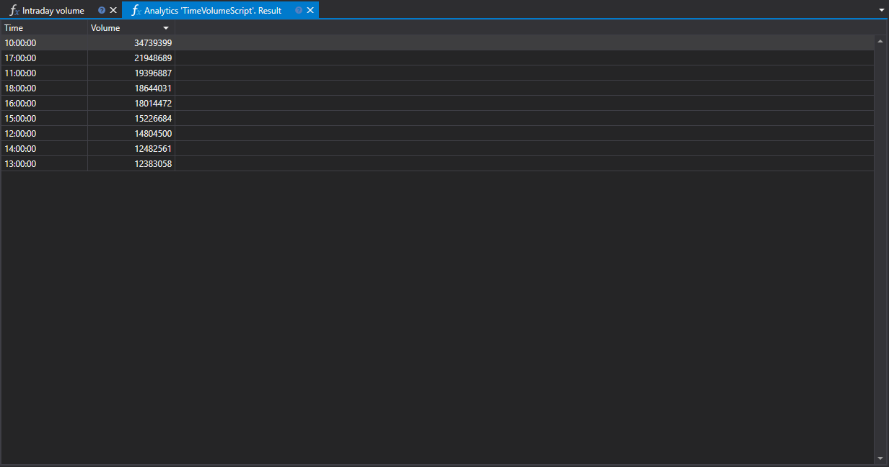

# Volume Intradiário

O script "Volume intradiário" é uma ferramenta para analisar a distribuição do volume de negociação de securities por horas dentro de uma única sessão de negociação. Concebido para utilização na plataforma StockSharp, destina-se a traders e analistas quantitativos que procuram um estudo aprofundado do comportamento do mercado e a otimização de estratégias de negociação.



## Descrição Funcional

O script recolhe dados sobre operações de negociação para um período selecionado e apresenta-os em formato de gráfico, permitindo aos utilizadores visualizar alterações no volume de negociação por hora. Isto oferece a possibilidade de avaliar quais as horas do dia que registam maior ou menor atividade de negociação.

## Importância Prática

- **Para Negociação**: Compreender as horas de pico e de menor atividade ajuda a identificar os períodos de mercado mais ativos, influenciando decisões sobre quando entrar ou sair de posições.
- **Para Análise Quantitativa**: Analistas quantitativos podem usar dados de volume intradiário para criar modelos matemáticos e algoritmos que preveem o comportamento do mercado com base em indicadores de volume.

## Distribuição Horária

A distribuição do volume de negociação por hora esclarece a dinâmica do mercado, destacando os intervalos temporais com a principal atividade de negociação. Isto pode indicar alterações de tendências, níveis de suporte e resistência, bem como potenciais momentos de maior liquidez ou de escassez da mesma.

## Aplicação dos Dados

O script "Volume intradiário" pode ser integrado num sistema mais amplo de análise de mercado, fornecendo dados que podem ser usados para:

- **Adaptação da Estratégia**: Ajustar parâmetros de algoritmos de negociação de acordo com os níveis de atividade do mercado.
- **Avaliação de Risco**: Calcular a probabilidade de movimentos significativos de preço consoante a hora do dia.

A utilização do script "Volume intradiário" na plataforma de negociação StockSharp permite que traders e analistas baseiem as suas decisões em dados específicos relativos à atividade do mercado e adaptem as suas estratégias para corresponder de forma ótima às condições atuais de negociação.

## Código do Script em C#

```cs
namespace StockSharp.Algo.Analytics
{
	/// <summary>
	/// O script analítico, calcula a distribuição do maior volume por horas.
	/// </summary>
	public class TimeVolumeScript : IAnalyticsScript
	{
		Task IAnalyticsScript.Run(ILogReceiver logs, IAnalyticsPanel panel, SecurityId[] securities, DateTime from, DateTime to, IStorageRegistry storage, IMarketDataDrive drive, StorageFormats format, DataType dataType, CancellationToken cancellationToken)
		{
			if (securities.Length == 0)
			{
				logs.LogWarning("No instruments.");
				return Task.CompletedTask;
			}

			// o script pode processar apenas 1 instrumento
			var security = securities.First();

			// obter o armazenamento de candles
			var candleStorage = storage.GetCandleMessageStorage(security, dataType, drive, format);

			// obter datas disponíveis para o período especificado
			var dates = candleStorage.GetDates(from, to).ToArray();

			if (dates.Length == 0)
			{
				logs.LogWarning("no data");
				return Task.CompletedTask;
			}

			// agrupar candles pela hora de abertura (apenas a parte da hora) com truncagem de 1 hora
			var rows = candleStorage.Load(from, to)
				.GroupBy(c => c.OpenTime.TimeOfDay.Truncate(TimeSpan.FromHours(1)))
				.ToDictionary(g => g.Key, g => g.Sum(c => c.TotalVolume));

			// colocar os nossos cálculos na grelha
			var grid = panel.CreateGrid("Time", "Volume");

			foreach (var row in rows)
				grid.SetRow(row.Key, row.Value);

			// ordenar pela coluna de volume (descendente)
			grid.SetSort("Volume", false);

			return Task.CompletedTask;
		}
	}
}

```

## Código do Script em Python

```python
import clr

# Adicionar referências .NET
clr.AddReference("StockSharp.Algo.Analytics")
clr.AddReference("StockSharp.Messages")
clr.AddReference("Ecng.Drawing")

from Ecng.Drawing import DrawStyles
from System import TimeSpan
from System.Threading.Tasks import Task
from StockSharp.Algo.Analytics import IAnalyticsScript
from storage_extensions import *
from candle_extensions import *
from chart_extensions import *
from indicator_extensions import *

# O script analítico, calcula a distribuição do maior volume por horas.
class time_volume_script(IAnalyticsScript):
	def Run(
		self,
		logs,
		panel,
		securities,
		from_date,
		to_date,
		storage,
		drive,
		format,
		data_type,
		cancellation_token
	):
		# Verificar se não existem instrumentos
		if not securities:
			logs.LogWarning("No instruments.")
			return Task.CompletedTask

		# O script pode processar apenas 1 instrumento
		security = securities[0]

		if data_type is None:
			logs.LogWarning(f"Tipo de dados não suportado {data_type}.")
			return Task.CompletedTask

		message_type = data_type.MessageType

		# Obter o armazenamento de candles
		candle_storage = get_candle_storage(storage, security, data_type, drive, format)

		# Obter datas disponíveis para o período especificado
		dates = get_dates(candle_storage, from_date, to_date)

		if len(dates) == 0:
			logs.LogWarning("no data")
			return Task.CompletedTask

		# Agrupar candles pela hora de abertura (truncagem horária) e somar os seus volumes
		candles = load_range(candle_storage, message_type, from_date, to_date)
		rows = {}
		for candle in candles:
			time_of_day = candle.OpenTime.TimeOfDay
			truncated = TimeSpan.FromHours(int(time_of_day.TotalHours))
			rows[truncated] = rows.get(truncated, 0) + candle.TotalVolume

		# Colocar os nossos cálculos na grelha
		grid = panel.CreateGrid("Time", "Volume")

		for key, value in rows.items():
			grid.SetRow(key, value)

		# Ordenar pela coluna Volume por ordem descendente
		grid.SetSort("Volume", False)

		return Task.CompletedTask

```
