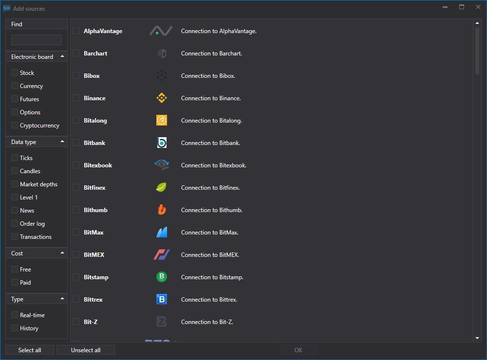
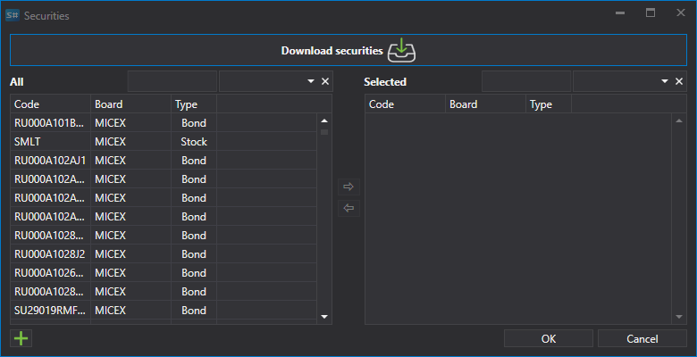
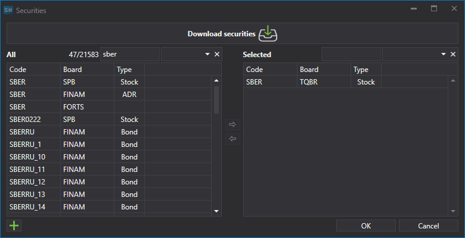

# Primeiro arranque

Na primeira execução, aparece a seguinte janela para selecionar fontes de dados. Também pode abrir esta janela no separador **Comum**, selecionando **Adicionar \=\> Fontes**.

Na janela, assinale as fontes necessárias. Pode utilizar filtros por região, board, tipo de dados, pagamento, em tempo real ou não. Quando a seleção estiver concluída, clique em **OK**. Em seguida, o programa irá propor a ativação dos utilitários. Para obter mais detalhes sobre o trabalho com utilitários, consulte a secção [Utilitários](tasks.md). Clique em **OK**.

Depois disso, as fontes serão adicionadas ao painel esquerdo da janela principal da aplicação.

## Transferir uma ferramenta para carregar dados de mercado:

Antes de iniciar a transferência de dados de mercado, é necessário configurar os instrumentos para os quais pretende obter dados de mercado.

Depois de adicionar fontes de dados de mercado, os painéis das fontes adicionadas serão abertos na parte central, onde é apresentada uma lista de instrumentos. Se o painel estiver fechado, para o abrir faça duplo clique no logótipo da fonte na lista do lado esquerdo do programa.

Por exemplo, transfira o instrumento AAPL@NASDAQ a partir de uma fonte de dados suportada.

> [!TIP]
> IMPORTANTE\! Os dados são transferidos apenas para os instrumentos adicionados à lista de instrumentos

1. Adicionar instrumentos.

   No primeiro arranque, o programa irá propor transferir todos os instrumentos de uma só vez para a fonte selecionada. Posteriormente, o próprio utilizador transferirá os instrumentos. Inicialmente, a base de dados de instrumentos em [Hydra](../hydra.md) está vazia; existe apenas um instrumento auxiliar **ALL@ALL**. Quando este instrumento é selecionado, os dados serão transferidos para todos os instrumentos disponíveis para esta fonte.

   Para adicionar um instrumento, clique no botão **Adicionar** . Em seguida, será aberta uma janela para transferir o instrumento. 

   Para transferir os instrumentos, é necessário clicar no botão **Transferir instrumentos** correspondente.

   Depois disso, será apresentado no ecrã um menu no qual o utilizador pode selecionar **Transferir todos os instrumentos**.

   Ou, para algumas fontes, [configurar](prepare_for_download/instruments_list.md) os instrumentos que pretende transferir.

   Depois de os instrumentos serem recebidos, a janela terá o seguinte aspeto.

   Serão listados todos os instrumentos disponíveis para adicionar. Para uma pesquisa rápida, pode introduzir o respetivo nome no campo apropriado.

   Para selecionar um instrumento, faça duplo clique nele e este será movido para o lado direito da lista.

   Em seguida, será movido para o lado direito da tabela.

   Os instrumentos selecionados serão apresentados na tabela **Instrumentos**, que é uma tabela com estrutura em árvore. O elemento principal é o instrumento; o elemento adicional são os tipos de dados de mercado que serão recebidos para esse instrumento.
2. Para cada instrumento selecionado, deve selecionar os tipos de dados de mercado necessários para transferência.

   Se nem todos os parâmetros necessários do instrumento estiverem definidos, o ícone  aparecerá na coluna esquerda da linha do instrumento. 

   Vamos selecionar a transferência de **Ticks** e **Velas período 5**.

   Na parte inferior da janela da fonte existe um painel com botões para configurar os dados e instrumentos a receber. 

   Neste painel podem ser executadas as seguintes operações:
   - Configurar a quantidade de informação recebida através dos botões: **Negócios, Livros de ofertas, Velas, Registo de ordens, Level 1, Transações próprias**. As listas de tipos de dados de mercado disponíveis variam consoante a fonte.
   - Especificar o período necessário para as velas carregadas. O período das velas recebidas é diferente para fontes diferentes.
   - Definir o período necessário para a transferência dos dados de mercado. O período também pode ser configurado diretamente na janela de dados de mercado. Para isso, deve selecionar o início e o fim do período.

     Se o utilizador não especificar a data de fim do período, o programa transfere todos os dados disponíveis até à data atual. Se a fonte suportar a transmissão de dados de mercado em tempo real, então, se não existir data de fim para o período, os dados de mercado serão transferidos em tempo real.

     Vamos definir o período para o qual é necessário transferir os dados de mercado.
   - Especificar a partir de que dados serão construídos os dados de mercado. Se este parâmetro não for especificado, serão recebidas as velas disponíveis na fonte. Se o utilizador especificar o tipo de dados de mercado, as velas serão construídas a partir do tipo de dados de mercado especificado. Por exemplo, as velas podem ser construídas a partir do preço da última transação, do spread do livro de ordens (normalmente para o mercado Forex), da volatilidade ou do melhor preço.

     Esta função é conveniente se a fonte não permitir receber dados para construir velas. Neste caso, as velas são construídas com base nos valores médios dos dados.

     O utilizador também tem a possibilidade de selecionar um [tipo personalizado](prepare_for_download/custom_candles.md) de velas para personalizar os dados recebidos.
   - Depois de selecionar um instrumento, o tipo de dados de mercado e definir o período, deve clicar no botão **Iniciar**. Depois disso, a transferência dos dados de mercado será iniciada.

   O processo de trabalho pode ser observado no separador especial **Registos**, fixado na parte inferior do programa. Além disso, os logs são guardados em ficheiros na pasta local.

Além disso, o utilizador pode adicionar [fontes adicionais](data_sources/select_source.md).

Depois de os dados de mercado serem transferidos, o utilizador pode [ver dados de mercado](working_with_data/view_and_export.md), [construir velas](working_with_data/candles_generation.md) , guardar ou [exportar em vários formatos](working_with_data/export_data.md).

**Ver [tutorial em vídeo](videos/first_start.md)**.
