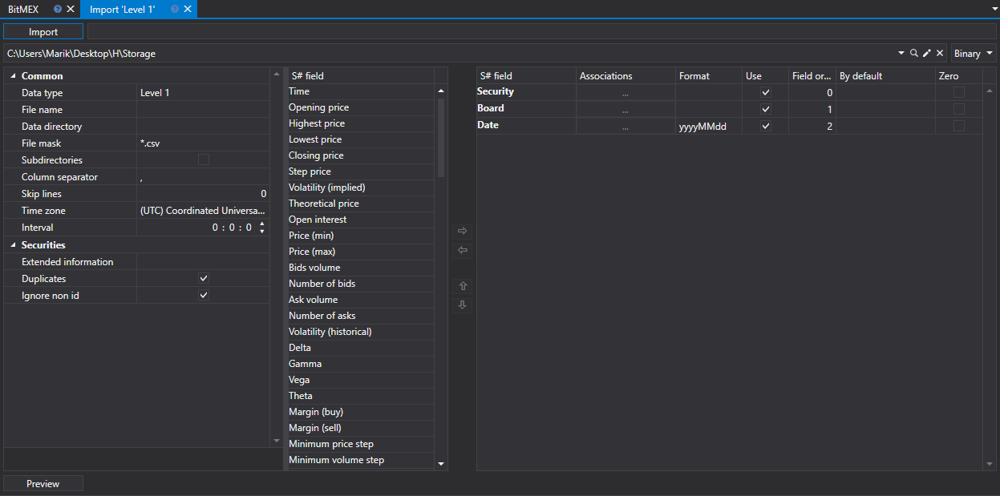
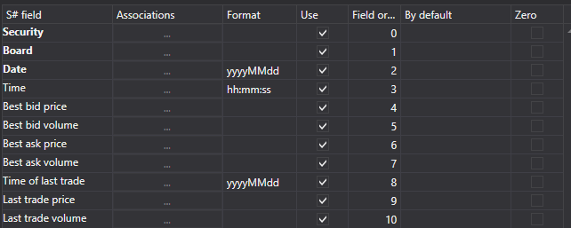

# Level 1

Para importar dados Level 1, selecione **Import \=\> Level 1** no menu principal da aplicação



## Processo de importação.

1. **Import settings.**.

   Consulte a importação de [Candles](candles.md).
2. Configure os parâmetros de importação para os campos [S#](../../api.md).

   Consulte a importação de [Candles](candles.md).

   **Vamos considerar um exemplo de importação de Level 1 a partir de um ficheiro CSV:**
   - O ficheiro a partir do qual pretende importar dados tem o seguinte modelo:

     ```none
     {SecurityId.SecurityCode};{SecurityId.BoardCode};{ServerTime:default:yyyyMMdd};{ServerTime:default:HH:mm:ss.ffffff};{Changes:{BestBidPrice};{BestBidVolume};{BestAskPrice};{BestAskVolume};{LastTradeTime};{LastTradePrice};{LastTradeVolume}}
     	  				
     ```

     Aqui, os valores de {SecurityId.SecurityCode} e {SecurityId.BoardCode} correspondem aos valores de **Security** e **Board**, respetivamente. Portanto, no campo **Field order**, atribuímos os valores 0 e 1, respetivamente.
   - Para os campos {ServerTime:default:yyyyMMdd} e {ServerTime:default:HH:mm:ss.ffffff}, selecione os campos Date e **Time** na janela **S# field**, respetivamente. Atribuímos-lhes os valores 2 e 3.
   - Para o campo {BestBidPrice}, selecione o campo **Best buy price** na janela **S# field**. Atribuímos-lhe o valor 4.
   - Para o campo {BestBidVolume}, selecione o campo **Best buy volume** na janela **S# field**. Atribuímos-lhe o valor 5.
   - Para o campo {BestAskPrice}, selecione o campo **Best sale price** na janela **S# field**. Atribuímos-lhe o valor 6.
   - Para o campo {BestAskVolume}, selecione o campo **Best sale volume** na janela **S# field**. Atribuímos-lhe o valor 7.
   - Para o campo {LastTradeTime}, selecione o campo **Last trade time** na janela **S# field**. Atribuímos-lhe o valor 8.
   - Para o campo {LastTradePrice}, selecione o campo **Last trade price** na janela **S# field**. Atribuímos-lhe o valor 9.
   - Para o campo {LastTradeVolume}, selecione o campo **Last trade volume** na janela **S# field**. Atribuímos-lhe o valor 10.
   - A janela de definição de campos terá o seguinte aspeto:

   O utilizador pode configurar um grande número de propriedades para os dados transferidos. Com base no modelo do ficheiro importado, é necessário especificar a propriedade e atribuir-lhe o número necessário na sequência.
3. Para pré-visualizar os dados, clique no botão **Preview**.
4. Clique no botão **Import**.
