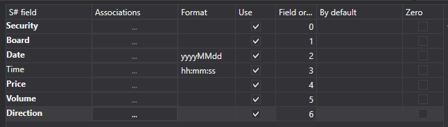

# Livros de ordens

Para importar livros de ordens, selecione o item **Importar \=\> Livros de ordens** no menu principal da aplicação.


## Processo de importação.

1. **Definições de importação**.

   Consulte a importação de [Velas](candles.md).
2. Configure os parâmetros de importação para os campos [S#](../../api.md).

   Consulte a importação de [Velas](candles.md).

   **Vamos considerar um exemplo de importação de um livro de ordens a partir de um ficheiro CSV:**
   - O ficheiro a partir do qual pretende importar dados tem o seguinte modelo:

     ```none
     {SecurityId.SecurityCode};{SecurityId.BoardCode};{ServerTime:default:yyyyMMdd};{ServerTime:default:HH:mm:ss.ffffff};{Quote.Price};{Quote.Volume};{Side}

     ```

     Aqui, os valores de {SecurityId.SecurityCode} e {SecurityId.BoardCode} correspondem aos valores de **Instrumento** e **Mercado**, respetivamente. Portanto, no campo **Ordem dos campos**, atribuímos os valores 0 e 1, respetivamente.
   - Para os campos {ServerTime:default:yyyyMMdd} e {ServerTime:default:HH:mm:ss.ffffff}, selecione os campos **Data** e **Hora** na janela **campo S#**, respetivamente. Atribuímos-lhes os valores 2 e 3.
   - Para o campo {Quote.Price}, selecione o campo **Preço** na janela **campo S#** - preço da cotação. Atribuímos-lhe o valor 4.
   - Para o campo {Quote.Volume}, selecione o campo **Volume** na janela **campo S#** - volume da cotação. Atribuímos-lhe o valor 5
   - Para o campo {Side}, selecione o campo **Direção** na janela **campo S#** - direção da transação (compra ou venda). Atribuímos-lhe o valor 6.
   - A janela de definição de campos terá o seguinte aspeto:

   O utilizador pode configurar um grande número de propriedades para os dados transferidos. Com base no modelo do ficheiro importado, é necessário especificar a propriedade e atribuir-lhe o número necessário na sequência.
3. Para pré-visualizar os dados, clique no botão **Pré-visualizar**.
4. Clique no botão **Importar**.
