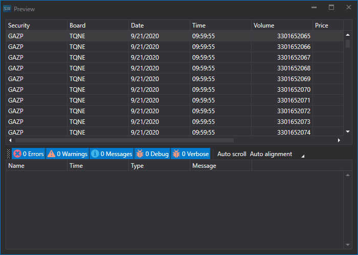

# Ticks

Para importar transações, selecione o separador **Importar \=\> Ticks**.


## Processo de importação.

1. **Definições de importação.**.

   Consulte a importação de [Velas](candles.md).
2. Configure os parâmetros de importação para os campos [S#](../../api.md).

   Consulte a importação de [Velas](candles.md).

   **Vejamos um exemplo de importação de transações (ticks) a partir de um ficheiro CSV:**
   - O ficheiro a partir do qual pretende importar dados tem o seguinte modelo:

     ```none
     {SecurityId.SecurityCode};{SecurityId.BoardCode};{ServerTime:default:yyyyMMdd};{ServerTime:default:HH:mm:ss.ffffff};{TradeId};{TradePrice};{TradeVolume};{OriginSide}

     ```

     Aqui, os valores de {SecurityId.SecurityCode} e {SecurityId.BoardCode} correspondem aos valores de **Instrumento** e **Mercado**, respetivamente. Por isso, no campo **Ordem dos campos** atribuímos os valores 0 e 1, respetivamente.
   - Para os campos {ServerTime:default:yyyyMMdd} e {ServerTime:default:HH:mm:ss.ffffff}, selecione os campos **Data** e **Hora** na janela **campo S#**, respetivamente. Atribuímos os valores 2 e 3.
   - Para o campo {TradeId}, selecione o campo **Identificador** na janela **campo S#** - o identificador da transação ou o número da transação. Atribuímos-lhe o valor 4.
   - Para o campo {TradePrice}, selecione o campo **Preço** - o preço da transação na janela **campo S#**. Atribuímos-lhe o valor 5.
   - Para o campo {TradeVolume}, selecione o campo **Volume** na janela **campo S#** - o volume da transação. Atribuímos-lhe o valor 6.
   - Para o campo {OriginSide}, selecione o campo **Iniciador** na janela **campo S#** - o iniciador da transação (vendedor ou comprador). Atribuímos-lhe o valor 7.
   - A janela de definição dos campos terá este aspeto:

   O utilizador pode configurar um grande número de propriedades para os dados descarregados. Com base no modelo do ficheiro importado, é necessário especificar a propriedade e atribuir-lhe o número necessário na sequência.
3. Para pré-visualizar os dados, clique no botão **Pré-visualizar**.
4. Clique no botão **Importar**.
