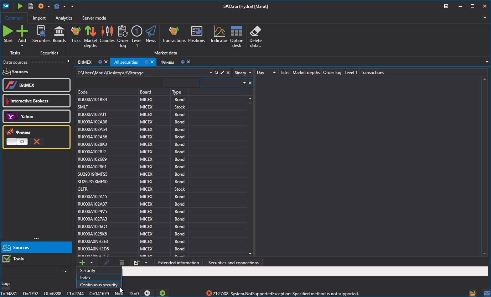
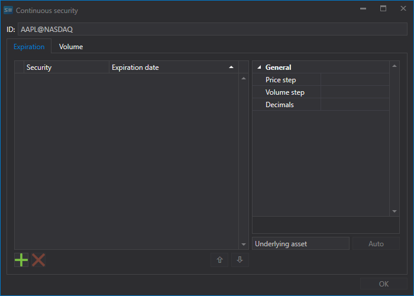

# Futuros contínuos

O programa [Hydra](../../hydra.md) permite ao utilizador combinar diferentes tipos de dados de mercado de vários contratos num único instrumento contínuo.

Para o fazer, no separador **Comum**, selecione **Instrumentos** para que apareça o separador **Todos os instrumentos**. Antes de combinar os dados, verifique que dados de mercado estão disponíveis. Selecione o caminho onde os dados se encontram e reveja os instrumentos que planeia combinar. Se existirem lacunas, descarregue os dados de mercado em falta (por exemplo, a partir de uma fonte de dados suportada).

Como exemplo, considere a combinação de futuros E-mini S&P 500.

1. Para criar um contrato de futuros contínuo, clique no botão **Criar instrumento \=\> Instrumento contínuo** no separador **Todos os instrumentos**.

   Depois disso, aparecerá a seguinte janela:
2. Para criar um futuro contínuo, é necessário especificar um nome e adicionar contratos.

   Existem duas formas de adicionar contratos.
   - Manualmente, clicando no botão .
   - Se definir as duas primeiras letras do contrato como nome, por exemplo, RI, e clicar no botão **Auto**, todos os instrumentos encontrados na base de dados serão adicionados.
3. Selecione os contratos necessários e defina as respetivas datas de transição. 
4. Em seguida, atribua o identificador de instrumento **ES\_continuous@CME** e clique no botão **OK**, após o que será criado um novo instrumento.
5. Em seguida, clique no botão [Velas](../working_with_data/view_and_export/candles.md) no separador **Comum**, selecione o instrumento resultante e o período dos dados, defina o valor **Elemento composto** no campo **Criar a partir de** e depois clique no botão . 

Os dados gerados podem ser exportados para os formatos Excel, XML, JSON ou TXT. A exportação é efetuada através da lista pendente.

