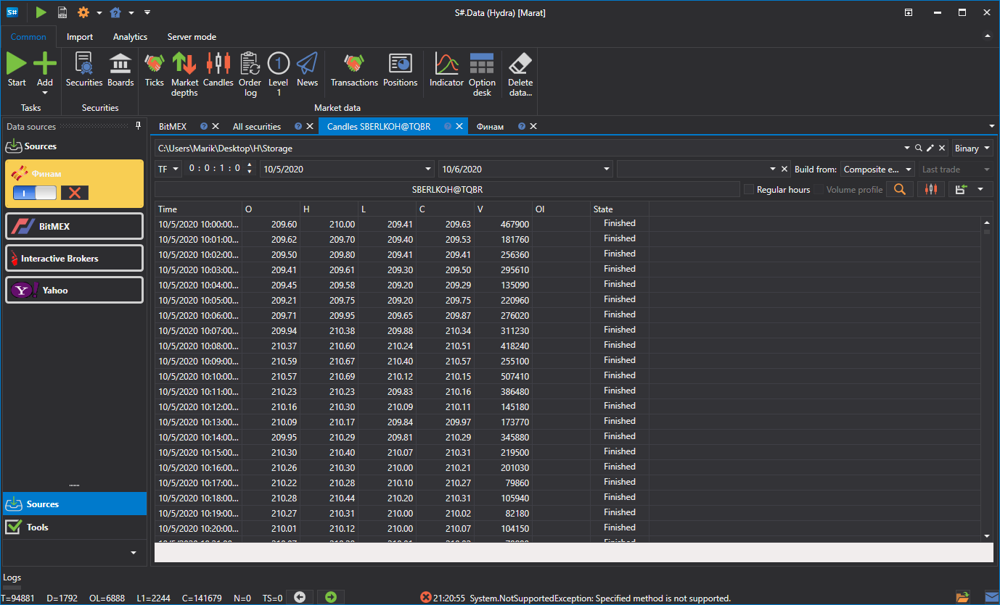

# Índice

Com o [Hydra](../../hydra.md), pode criar o seu próprio índice.

No separador **Common**, selecione **Securities** para que apareça o separador **All Securities**.

Antes de criar o **Index**, verifique que dados de mercado estão disponíveis. Selecione o caminho onde os dados estão armazenados e veja sequencialmente os instrumentos que devem participar no cálculo do índice. Se existirem lacunas, descarregue os dados de mercado necessários a partir de uma fonte de dados suportada.

Como exemplo, considere o índice de rácio de instrumentos AAPL@NYSE\/GOOG@NYSE.

1. O primeiro passo é criar o **Index**. No separador **All Securities**, clique em **Create security \=\> Index** .
2. Aparece a seguinte janela: 
3. Para criar o instrumento **Index**, especifique um nome e adicione a fórmula matemática para uma combinação de vários instrumentos. Juntamente com os operadores matemáticos padrão, pode utilizar as seguintes funções:
   - **abs(a)** - Devolve o valor absoluto de um número.
   - **acos(a)** - Devolve o ângulo cujo cosseno é igual ao número especificado.
   - **asin(a)** - Devolve o ângulo cujo seno é igual ao número especificado.
   - **atan(a)** - Devolve o ângulo cuja tangente é igual ao número especificado.
   - **ceiling(a)** - Devolve o menor inteiro que é maior ou igual ao número especificado.
   - **cos(a)** - Devolve o cosseno do ângulo especificado.
   - **exp(a)** - Devolve o valor de **e** elevado à potência especificada.
   - **floor(a)** - Devolve o maior inteiro que é menor ou igual ao número especificado.
   - **log(a)** - Devolve o logaritmo natural (base **e**) do número especificado.
   - **log10(a)** - Devolve o logaritmo de base 10 do número especificado.
   - **max (a, b)** - Devolve o maior de dois números decimais.
   - **min(a, b)** - Devolve o menor de dois números decimais.
   - **pow(a, b)** - Devolve o número especificado elevado à potência especificada.
   - **sign(a)** - Devolve um inteiro que indica o sinal do número especificado.
   - **sin(a)** - Devolve o seno do ângulo especificado.
   - **sqrt (a)** - Devolve a raiz quadrada do número especificado.
   - **tan(a)** - Devolve a tangente do ângulo especificado.
   - **truncate(a)** - Calcula a parte inteira do número especificado.
4. Introduza a operação matemática que será utilizada para calcular o índice. 
5. Em seguida, clique em [Candles](../working_with_data/view_and_export/candles.md) no separador **Common**, selecione o instrumento **Index** criado e o período dos dados, defina **Composite Element** no campo **Create From:** e depois clique em . 

Os dados gerados podem ser exportados para os formatos Excel, XML ou TXT. A exportação é feita através da lista pendente.

