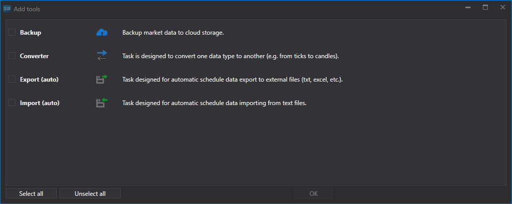

# Definições do Hydra

A seguir descreve-se como criar e configurar uma tarefa de cópia de segurança.

1. Para criar uma tarefa, clique no botão **Add tasks...**; na janela que se abre, selecione o item **Backup** e clique no botão **OK**.
2. Em seguida, é necessário configurar a tarefa.

   **Backup**
   - **Service** - o endereço do serviço. 
  - **Address** - o endereço da região. O endereço da região especificado nas definições do bucket. Consulte [Regions and Endpoints](https://docs.aws.amazon.com/general/latest/gr/rande.html#s3_region).
   - **Storage** - o nome do bucket. 
   - **Login** - login. Access Key ID. 
   - **Password** - palavra-passe. **Secret Access Key**. 
   - **Start date** - a partir de que data iniciar a cópia de segurança. 
   - **Time offset** - um desvio em dias a partir da data atual. 

   **General**
   - **Header** - conversor. 
   - **Working hours** - configuração do horário de funcionamento da board. 
   - **Interval of operation** - o intervalo de operação. 
  - **Data directory** - diretório de dados, a partir do qual serão recebidos os dados para conversão.
   - **Format** - o formato dos dados convertidos: BIN\/CSV. 
   - **Max. errors** - o número máximo de erros após o qual a tarefa será parada. Por predefinição, 0 - o número de erros é ignorado. 
   - **Dependency** - uma tarefa que deve ser executada antes de iniciar a atual. 

   **Logging**
   - **Identifier** - o identificador. 
   - **Logging level** - o nível de logging. 
3. Depois de configurar a tarefa, adicione os instrumentos que devem ser guardados no armazenamento de cópia de segurança e clique no botão **Iniciar**.

## Conteúdo recomendado

[Criar e configurar uma conta](setup.md)
