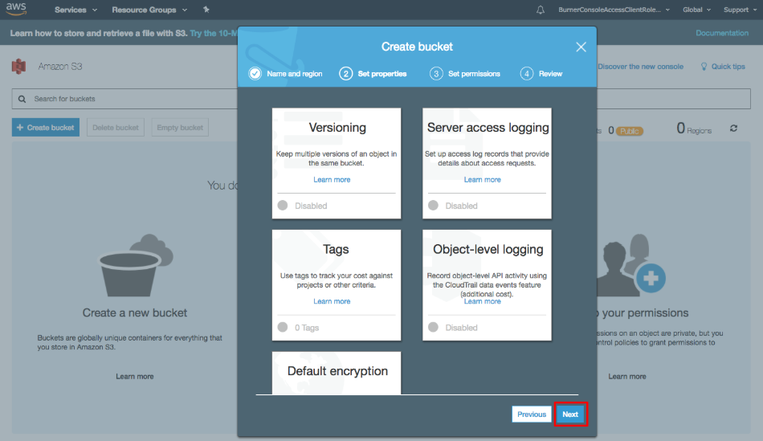

# Configuração

A seguir descreve-se como criar e configurar uma conta AWS.

1. Para criar uma conta AWS, aceda à página [Criar uma conta AWS](https://aws.amazon.com/ru/) e clique no botão **Criar conta**.
2. Em seguida, preencha os formulários que o serviço Web apresentar.
3. Preencha os dados do seu cartão; isto é feito para verificar a sua identidade.
4. Num dos passos de registo, ser-lhe-á pedido que introduza um número de telefone e inicie uma chamada para o seu telefone através do botão **Call Me Now**.

   Deve atender a chamada e marcar no telefone o código que será apresentado no ecrã do computador.
5. Em seguida, ser-lhe-á pedido que selecione um plano de suporte. Após concluir a criação da conta, deve ir para a consola de gestão.
6. O primeiro passo na configuração de uma conta é criar um Bucket.

   Bucket é um contentor para armazenar objetos na nuvem. Para o Bucket, deve definir um nome único e também selecionar um centro de dados regional (Region) onde os dados são fisicamente armazenados. Tenha em atenção que, mais tarde, ao configurar a tarefa de cópia de segurança: 1) no campo **Armazenamento**, terá de introduzir o nome do bucket; 2) no campo **Endereço**, deve utilizar não o nome, mas o endereço do centro de dados regional, que pode ser encontrado [aqui](https://docs.aws.amazon.com/general/latest/gr/rande.html#s3_region). Depois continue a configuração.
7. Em seguida, deve configurar chaves para aceder programaticamente aos serviços AWS. Para o fazer, vá para a ligação **Security Credentials** na consola AWS.
8. Expanda o cabeçalho **Access Keys (Access Key ID and Secret Access Key)** e crie chaves de acesso utilizando o botão .

  As chaves criadas podem ser guardadas num ficheiro utilizando o botão **Download Key File**.

   Tenha em atenção que, ao configurar uma tarefa de cópia de segurança, o **Access Key ID** deve ser utilizado como início de sessão e a **Secret Access Key** como palavra-passe.

## Conteúdo recomendado

[Criar e configurar uma tarefa](hydra_settings.md)
