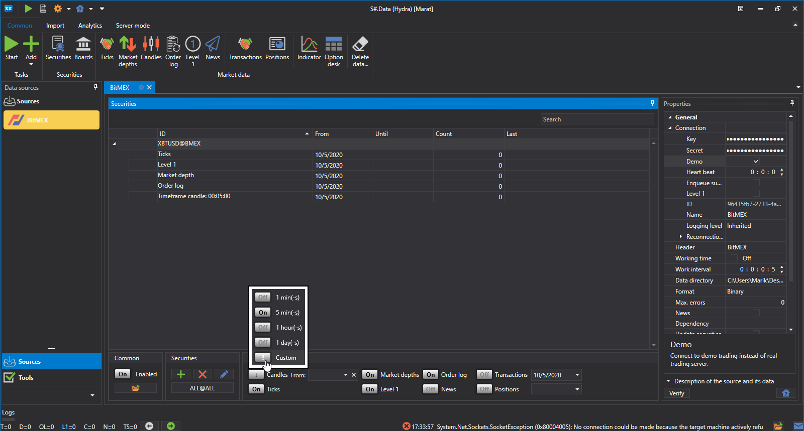

# Candles personalizados

O utilizador pode selecionar um **Custom type** de candles e escolher de forma independente que candles serão construídos, sendo os candles construídos "on the fly", ou seja, imediatamente.

Vejamos um exemplo desta construção. A bolsa **Bitmex** não disponibiliza a possibilidade de receber candles com um Time Frame de 10 minutos.

A sequência para obter esses candles:

1. Selecione candles **Custom**
2. Nas definições, especificamos candles **TF** e um período de 10 minutos
3. Na fonte, especificamos a partir do que os candles serão construídos - **Order Log** 
4. Definimos o período. Como pode ver, junto ao nome do candle apareceu a indicação **Generated**.
5. Clique em Start e os dados começam a ser descarregados.
6. Vamos à secção de candles e [ver os dados descarregados](../working_with_data/view_and_export.md).

Como pode ver, os dados foram recebidos com sucesso.

Considere um exemplo em que precisamos de obter uma [RangeCandleMessage](xref:StockSharp.Messages.RangeCandleMessage):

1. Selecione candles **Custom**.
2. Nas definições, especifique os candles Range e o volume 10.
3. Na fonte, especificamos a partir do que os candles serão construídos - **Ticks**.
4. Definimos o período.
5. Clique em Start e os dados começam a ser descarregados.
6. Vamos à secção de candles e [ver os dados descarregados](../working_with_data/view_and_export.md).
