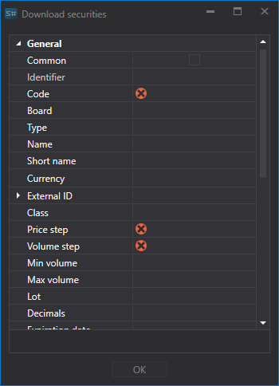
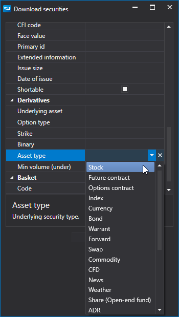

# Lista de instrumentos

Configuração do instrumento para descarregamento.

Para algumas fontes, é possível configurar o descarregamento dos instrumentos necessários.

Vejamos um exemplo de descarregamento de instrumentos a partir da fonte **Interactive Brokers**: 

1. Selecione descarregar instrumentos e clique no botão **Condição avançada**.
2. Depois disso, será aberta uma lista de definições avançadas para o instrumento descarregado.
3. É necessário descarregar um instrumento que cumpra os seguintes parâmetros: ação APPLE, moeda - dólar americano. Para isso, definimos os parâmetros do instrumento conforme mostrado abaixo e clicamos em **OK**.

   Depois disso, o programa [Hydra](../../hydra.md) descarregará todos os instrumentos que correspondam aos parâmetros especificados. 

A definição permite ao utilizador selecionar vários parâmetros para o instrumento descarregado. 

Assim, por exemplo, o utilizador pode selecionar:

- **Passo de preço e volume**
- **Volumes mínimo e máximo**
- **ID externo** 
- Para opções, permite definir o **Ativo subjacente** e o **Tipo de ativo** (tipo do instrumento subjacente). 

**Veja o [tutorial em vídeo](../videos/instruments_downloading.md)**
