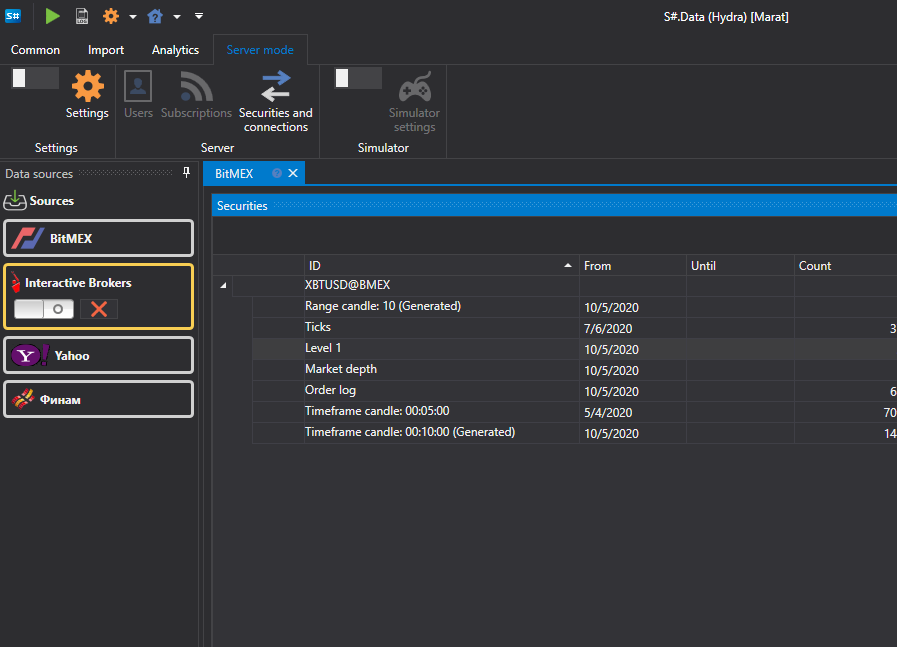

# Definições

[Hydra](../../hydra.md) pode ser utilizado em modo de servidor; neste modo, pode ligar-se remotamente ao [Hydra](../../hydra.md) e obter os dados existentes no armazenamento. Pode ligar-se ao [Hydra](../../hydra.md) em execução no modo de servidor a partir do [Designer](../../designer.md) (consulte [Introdução](../../designer/market_data_storage/getting_started.md) na documentação do [Designer](../../designer.md) para saber como fazê-lo). Também pode ligar-se ao [Hydra](../../hydra.md) através da [API](../../api.md) (consulte a secção [ligação FIX/FAST](fix_fast_connectivity.md) para obter detalhes).

No modo de servidor, o programa [Hydra](../../hydra.md) permite ao utilizador trabalhar usando uma ligação, com vários programas ao mesmo tempo. Ao definir a chave de acesso nas definições do programa, o utilizador pode trabalhar simultaneamente com uma fonte numa única conta.

Na prática, a ligação à fonte ocorre através do [Hydra](../../hydra.md), ao qual, por exemplo, o [Designer](../../designer.md) e o [Terminal](../../terminal.md) estão ligados em simultâneo. Este método permite evitar a religação entre programas e a compra de uma ligação adicional. Com este modo de trabalho, são excluídos conflitos cuja ocorrência se deve ao registo de ordens ou a negociações provenientes de diferentes programas. O [Hydra](../../hydra.md) recebe o sinal e devolve o resultado ao programa de onde foi recebido, sem perturbar a sequência das restantes operações.

Para ativar o modo de servidor do [Hydra](../../hydra.md), selecione o separador **Modo de servidor** no menu superior do programa.

Depois disso, clique no botão **Definições** para abrir a janela de definições do modo de servidor.

**Servidor Hydra**

- **Servidor FIX** - muda o [Hydra](../../hydra.md) para o modo de servidor, distribuindo negociação em tempo real e dados históricos através do protocolo FIX.

  Nesta secção, configura a ligação para trabalhar com fontes:
  1. **ConvertToLatin** - converter cirílico para latim
  2. **QuotesInterval** - período de atualização das cotações
  3. **TransactionSession** - definição de uma sessão de negociação. Configuração para negociação através do programa [Hydra](../../hydra.md).

     Esta definição permite configurar o dialeto do protocolo FIX, o remetente e o destinatário, o formato dos dados e outras definições. Consulte as [propriedades FIXServer](https://doc.stocksharp.com/html/Properties_T_StockSharp_Fix_FixServer.htm) para obter detalhes.
  4. **MarketDataSession** - definições para a transferência de dados de mercado recebidos através do [Hydra](../../hydra.md). Consulte as [propriedades FIXServer](https://doc.stocksharp.com/html/Properties_T_StockSharp_Fix_FixServer.htm) para obter detalhes.
  5. **KeepSubscriptionsOnDisconnect** - manter subscrições quando a ligação à fonte é desligada.
  6. **DeadSessionCleanupInterval** - após que intervalo de tempo a informação será limpa se a ligação for desligada.
- **Autorização** - autorização para obter acesso ao servidor Hydra
- **Número de instrumentos** - o número máximo de instrumentos que podem ser solicitados ao servidor
- **Velas (dias)** - o número máximo de dias disponíveis para descarregar o histórico de velas
- **Ticks (dias)** - o número máximo de dias disponíveis para descarregar o histórico de dados de ticks
- **Livros de ordens (dias)** - o número máximo de dias disponíveis para descarregar o histórico de livros de ordens
- **OL (dias)** - o número máximo de dias disponíveis para descarregar o histórico de dados OL
- **Transações (dias)** - o número máximo de dias disponíveis para descarregar o histórico de transações
- **Simulador** - ativar o modo de simulador
- **Mapeamento de instrumentos** - ativar o modo de transferência apenas dos instrumentos especificados.

Se definir **Autorização** como algo diferente de **Anónimo**, o botão **Utilizadores** aparecerá no separador **Comum**. Depois de clicar nele, aparece a janela **Utilizadores**.

No lado esquerdo da janela, pode adicionar um novo utilizador e, no lado direito, definir os respetivos direitos de acesso.
