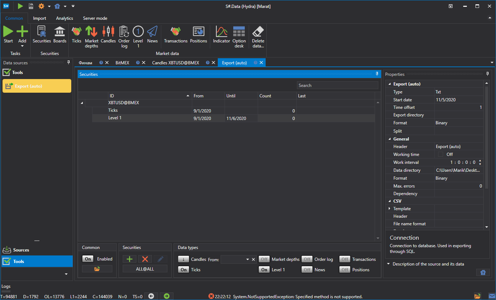
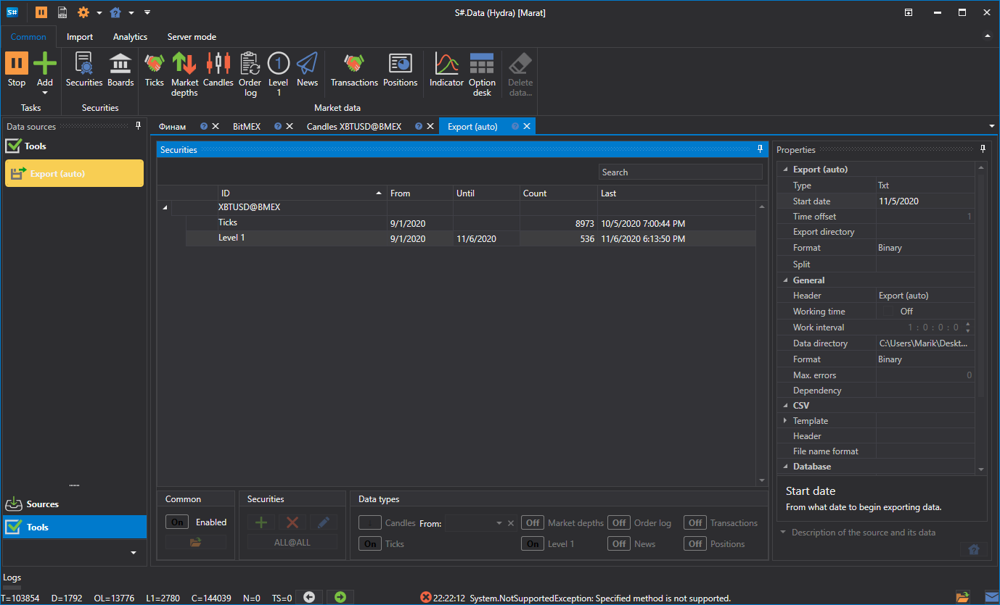
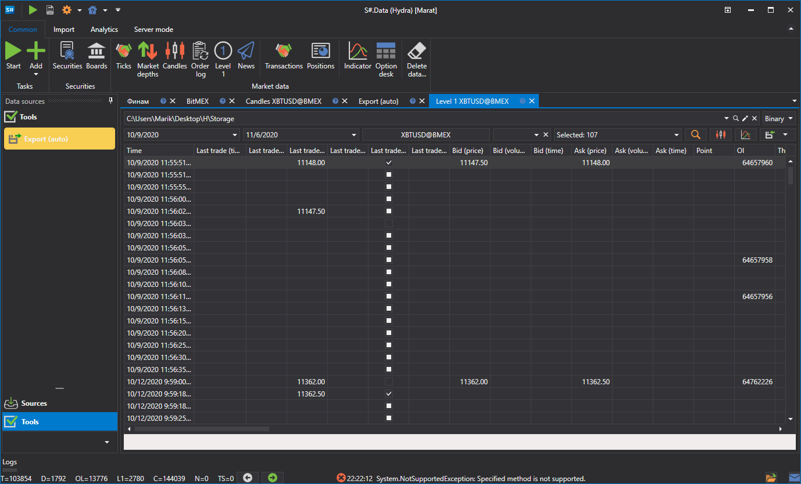

# Exportação (automática)

A tarefa exporta dados da bolsa para vários formatos: Excel, xml, sql, bin, Json ou txt.

**Base de dados**

- **Ligação** - ligação à base de dados. Utilizado no caso de exportação via SQL.
- **Pacote** - o tamanho do pacote de dados transmitido. Por predefinição, o tamanho é de 50 elementos. Utilizado no caso de exportação via SQL.
- **Unicidade** - verificar a unicidade dos dados na base de dados. Afeta o desempenho. Ativado por predefinição. Utilizado no caso de exportação via SQL.

> [!TIP]
> Ao utilizar exportação via SQL, é necessário definir os parâmetros da string de ligação

**Nova string de ligação**

- **Fornecedor** - definições do fornecedor.
- **Servidor** - endereço do servidor ou caminho para a base de dados.
- **Base de dados** - nome da base de dados. Não utilizado para SQLite.
- **Login** - login para aceder à base de dados. Não utilizado para acesso anónimo.
- **Palavra-passe** - palavra-passe para aceder à base de dados. Não utilizada para acesso anónimo.
- **Windows** - utilizar a conta atual do Windows para ligar à base de dados.
- **Ligação** - string de ligação pronta a utilizar.

> [!TIP]
> Pode verificar a ligação à base de dados usando o botão **Verificar**.

**Geral**

- **Cabeçalho** - Converter.
- **Horário de trabalho** - configuração do horário de funcionamento da board. 
- **Intervalo de operação** - o intervalo de funcionamento.
- **Diretório de dados** - diretório de dados, de onde serão recebidos os dados para conversão.
- **Formato** - o formato dos dados convertidos: BIN\/CSV.
- **Máx. erros** - o número máximo de erros; ao atingi-lo, a tarefa será parada. Por predefinição, 0 - o número de erros é ignorado.
- **Dependência** - uma tarefa que deve ser executada antes de iniciar a atual.

**CSV**

- **Modelos** - modelos para cada tipo de dados exportados.
- **Cabeçalho** - o cabeçalho na primeira linha. Se for passada uma string vazia, o cabeçalho não será adicionado ao ficheiro.
- **Formato do nome** - o formato para escrever o nome do ficheiro exportado.

**Exportação (automática)**

- **Tipo** - tipo de exportação (formato).
- **Data inicial** - a partir de que data iniciar a exportação de dados.
- **Desfasamento temporal** - desfasamento temporal em dias.
- **Diretório de exportação** - diretório para onde os dados serão exportados.
- **Formato** - formato dos dados.
- **Split** - tipo de divisão.

**Registo**

- **Identificador** - o identificador.
- **Nível de registo** - o nível de registo.

Consideremos um exemplo de exportação automática:

1. Selecione o instrumento.
2. Configure os dados de mercado que precisam de ser exportados.
3. Defina o período de exportação. Se estiver configurado o descarregamento de dados de mercado em tempo real, pode omitir a data de fim do período. Neste caso, os dados serão exportados em tempo real, de acordo com o intervalo de trabalho (atualização dos dados). 
4. Configuração de diretórios. Intervalo de funcionamento. Tipo de dados. Formato dos dados.
5. Iniciamos a exportação.

Vamos ver os dados exportados

**Veja o [tutorial em vídeo](../videos/export_task.md)**
