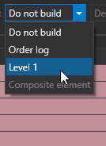
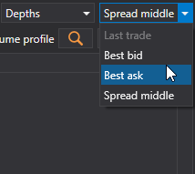
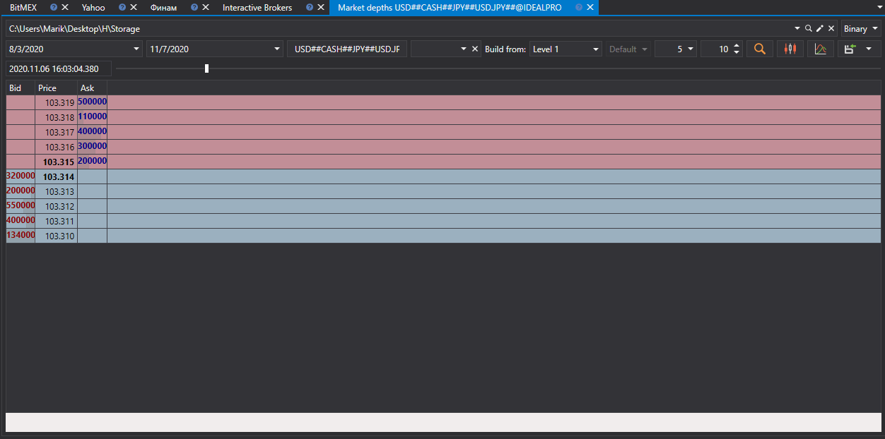

# Quaisquer tipos de dados de mercado

O [Hydra](../../hydra.md) permite utilizar tipos de dados alternativos para obter vários tipos de dados de mercado.

Isto é necessário se a origem não permitir descarregar os dados de mercado necessários. Assim, por exemplo, podem ser usados vários tipos de dados de mercado ao mesmo tempo para construir o **Livro de ordens**.

IMPORTANT\! O **Livro de ordens** pode ser construído a partir do **Log de ordens** ou de **Level 1**, desde que estes tipos de dados contenham os melhores preços.

Tenha em conta que os valores de **Level 1** podem ser descarregados de qualquer origem que forneça dados de mercado em tempo real. **Level 1** também pode ser recebido por [conversão](../tasks/converter.md) a partir do **Livro de ordens**.

Para o construir, é necessário:

1. Selecionar o período e o instrumento para os quais pretende obter dados de mercado.
2. Selecionar o campo **Build from** e escolher o tipo de dados necessário

   IMPORTANT\! Se **Order Book, Order Log, Level 1** forem selecionados como origem para construir uma candle, aparece uma seleção de parâmetros adicionais.
3. Depois de definir os parâmetros, clique no botão .

Para construir **Candles**, também está disponível a opção de construir candles de um Time Frame maior a partir de candles de um Time Frame menor. 

Por exemplo, se existirem candles com um Time Frame de 1 minuto, pode construir candles com um Time Frame de 5 minutos a partir delas, selecionando o tipo adequado na linha **Build from**.

**Veja o [tutorial em vídeo](../videos/building_order_books.md)**
