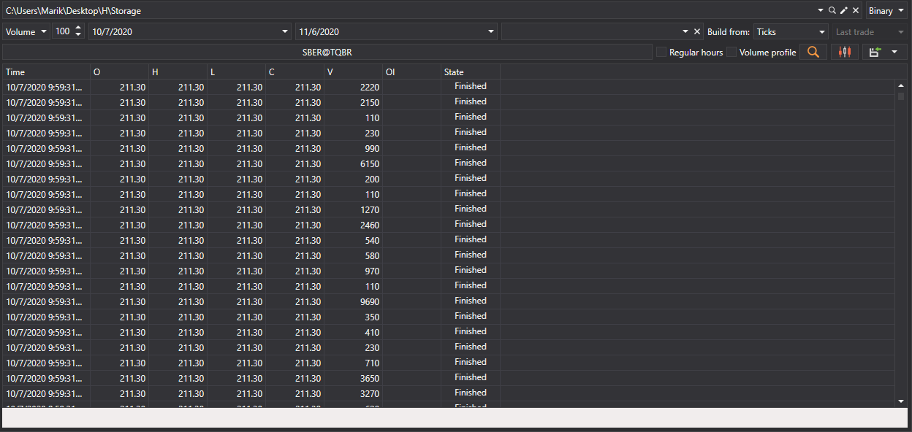
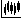

# Geração de velas

O [Hydra](../../hydra.md) permite gerar vários tipos de candles com base nos negócios descarregados, que posteriormente podem ser exportadas para formatos [Excel](https://en.wikipedia.org/wiki/Excel), XML, SQL, BIN, JSON ou TXT.

Isto permite utilizar os dados gerados em quaisquer programas de análise técnica (WealthLab, AmiBroker, etc.).

## Processo de geração de velas

1. No separador **Geral**, clique no botão **Velas**; será aberta a seguinte janela:

   

2. Na janela aberta, é necessário configurar os parâmetros de geração de candles:

   - Selecione o tipo de candle pretendido na lista pendente (todos os [tipos de candles padrão](../../api/candles.md) são suportados)
   - Especifique os parâmetros necessários para o tipo de candle selecionado:
     - Para [TimeFrameCandleMessage](xref:StockSharp.Messages.TimeFrameCandleMessage) - selecione **Período**
     - Para [VolumeCandleMessage](xref:StockSharp.Messages.VolumeCandleMessage) - especifique **Volume**
     - Para [TickCandleMessage](xref:StockSharp.Messages.TickCandleMessage) - especifique **Número de ticks**
     - Para [RangeCandleMessage](xref:StockSharp.Messages.RangeCandleMessage) - especifique **Intervalo**
     - Para [RenkoCandleMessage](xref:StockSharp.Messages.RenkoCandleMessage) - especifique **Tamanho do bloco**
     - Para [PnFCandleMessage](xref:StockSharp.Messages.PnFCandleMessage) - especifique **Parâmetros P&F**
   - Selecione o instrumento para o qual as candles serão geradas
   - Especifique um intervalo temporal (se necessário)
   - Clique no botão  para iniciar a geração

### Exemplo de geração de velas por período

Para gerar candles de 5 minutos para o instrumento AAPL@NASDAQ:

1. Selecione o tipo de candle [TimeFrameCandleMessage](xref:StockSharp.Messages.TimeFrameCandleMessage)
2. Defina **Período** = 5 min
3. Selecione o instrumento AAPL@NASDAQ
4. Clique no botão de pesquisa

Depois da geração dos dados, verá o resultado:

### Exemplo de geração de velas de volume

Para gerar candles de volume:

1. Selecione o tipo de candle [VolumeCandleMessage](xref:StockSharp.Messages.VolumeCandleMessage)
2. Especifique o volume (por exemplo, 100)
3. Selecione o instrumento
4. No campo **Construir a partir de**, selecione **Ticks**
5. Clique no botão de pesquisa

Resultado da geração:

## Origens de dados para construir velas

Se os dados de mercado não puderem ser obtidos diretamente a partir da origem, pode gerar candles selecionando, no campo [**Construir a partir de**](any_market_data_types.md), o tipo de dados a partir do qual serão construídas:

- **Ticks** - construção de candles a partir de dados de ticks
- **Livros de ordens** - construção de candles a partir de dados do livro de ordens
- **Level1** - construção de candles a partir de dados Level1
- **Período menor** - construção de candles com um período maior a partir de candles com um menor

### Exemplos de Diferentes Opções de Construção:

- Velas de 10 minutos a partir de ticks:

  

- Velas de 30 minutos a partir de velas de 5 minutos:

  

> [!TIP]
> Se selecionar **não construir** no campo **Construir a partir de**, serão pesquisadas apenas candles prontas que tenham sido descarregadas diretamente através da origem de dados.

## Visualização das velas geradas

Para apresentação gráfica das candles geradas:

1. Clique no botão 
2. Será aberto um gráfico com as candles construídas:

   

   

## Adicionar Indicadores ao Gráfico

Podem ser adicionados indicadores técnicos ao gráfico de candles:

1. Abra o menu de contexto clicando com o botão direito do rato no painel do gráfico
2. Selecione o item **Indicador** e o indicador pretendido na lista
3. Para apresentar o indicador num painel separado:
   - Adicione um novo painel usando o botão 
   - Selecione o indicador pretendido no menu de contexto

Exemplo de um gráfico com indicadores adicionados:

## Exportação de Dados

Os valores de candles obtidos podem ser [exportados para vários formatos](export_data.md) para utilização noutros programas.

**Veja também o [tutorial em vídeo](../videos/building_candles.md) sobre a construção de vários tipos de candles**
