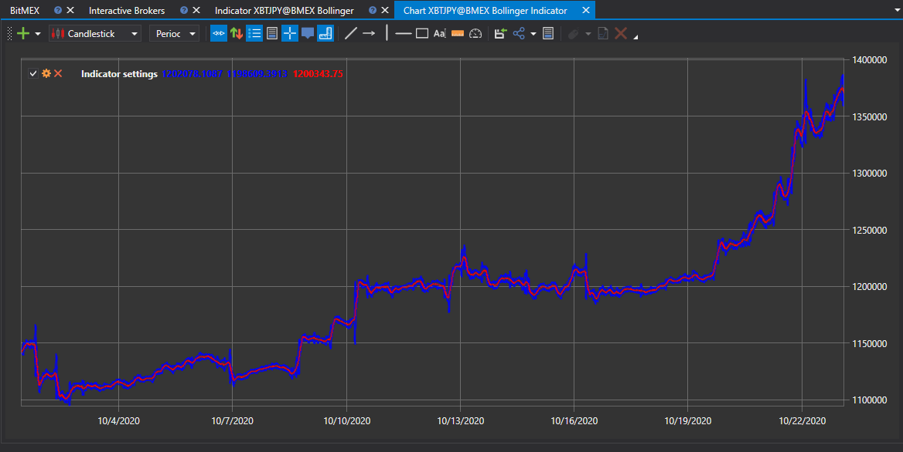

# Indicadores

No painel que aparece, selecione o instrumento, o intervalo temporal de interesse, especifique o tipo de dados a partir do qual o indicador será construído, defina o [indicador](../../../api/indicators/list_of_indicators.md) e os respetivos parâmetros, e depois clique no botão : :

Para ver o gráfico dos valores, basta clicar no botão .

Os valores recebidos podem ser [exportados para o formato necessário](../export_data.md).
