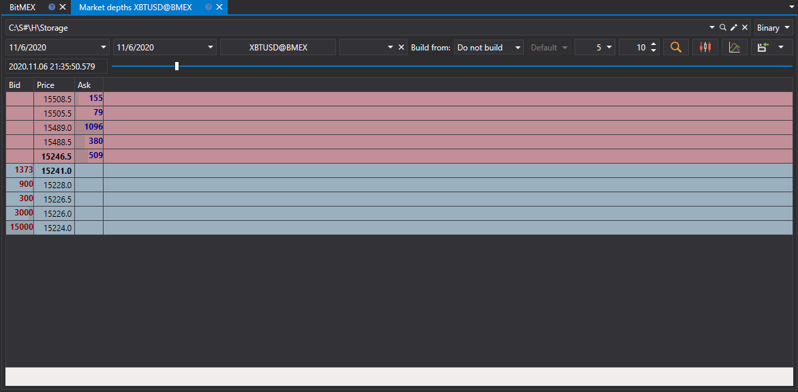

# Livros de ordens

Na janela que aparece, selecione os instrumentos, o intervalo temporal necessário e clique no botão :

> [!TIP]
> Os livros de ordens podem ser criados a partir de [ficheiros de Log de ordens e Level 1](../any_market_data_types.md). Além disso, pode ajustar a profundidade e o período de atualização do livro de ordens.

Os valores recebidos podem ser [exportados para o formato necessário](../export_data.md).
