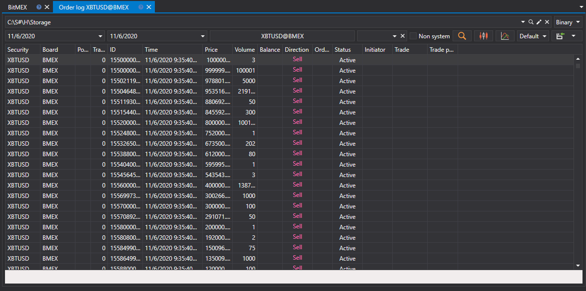

# Log de ordens

Na janela que aparece, selecione os instrumentos, o intervalo temporal necessário e clique no botão :

Os valores recebidos podem ser [exportados para o formato necessário](../export_data.md).
