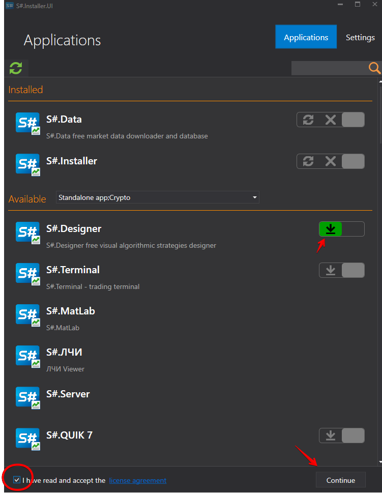

# Instalar e remover aplicações

O programa [Installer](../installer.md) permite selecionar o tipo de aplicação para encontrar o produto de que precisa.

Para instalar a aplicação necessária, é preciso:

1. Selecionar uma aplicação, clicar em **Instalar**, aceitar o contrato de licença e clicar em **Continuar**.
2. Depois disso, é necessário selecionar o caminho de instalação. 

   **IMPORTANT\!** A pasta na qual o programa será instalado deve estar vazia. 

   Clique em **Continuar**.
3. Selecionar **Executar** e aguardar que a instalação seja concluída. 

Depois de concluída a instalação, o programa está pronto a usar. 

Para desinstalar o programa, selecione **Desinstalar** e clique no botão **Continuar**.

Para restaurar, selecione **Restaurar** e clique em **Continuar**.

**Veja o [tutorial em vídeo](videos/install_and_remove_apps.md)**

## Conteúdo recomendado

[Atualizar aplicações](update_apps.md)
