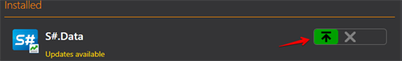

# Atualizar aplicações

O [Installer](../installer.md) acompanha todas as atualizações de software e atualiza-se automaticamente. Portanto, não é necessário desinstalá-lo após a instalação. 

Para verificar manualmente se existem atualizações disponíveis, deve clicar no botão **Atualizações** no canto direito da janela do programa. 

Se estiverem disponíveis atualizações para o programa, o [Installer](../installer.md) notificá-lo-á em conformidade. 

Depois é necessário clicar no botão.

O [Installer](../installer.md) não é fechado clicando no **"X"** na janela do programa; é fechado através da barra de ferramentas.

Para isso, aceda ao menu clicando com o botão direito do rato e clique em **Fechar**.

**Veja o [tutorial em vídeo](videos/update_apps.md)**.

## Conteúdo recomendado

[Instalar e remover aplicações](install_and_remove_apps.md)
