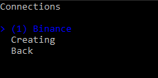
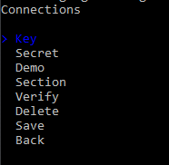
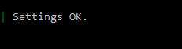
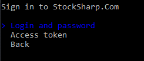

# Configuração da Ligação

O **Runner**, além de [exportar definições através do Designer](export_from_designer.md), permite configurar o programa através da sua interface de consola. Para isso, é necessário executar o programa com o comando **setup**:

```cmd
stocksharp.studio.runner setup
```

Será apresentado um menu:


Ao selecionar o item Connections, o programa entrará no modo de configuração do conector:



Aqui pode editar uma ligação guardada anteriormente ou criar uma nova:


Depois de selecionar o tipo pretendido da nova ligação, o programa passará para o menu de edição das respetivas definições:



Para a [Binance](../api/connectors/crypto_exchanges/binance.md), é necessário introduzir as suas definições principais:


Para verificar a correção dos dados introduzidos, selecione **Verificar**:


A verificação da ligação será iniciada:


Em caso de sucesso, será apresentada uma mensagem:



Depois de introduzir todas as definições e as verificar, deve premir **Guardar**:


Na pasta Data, será criado um ficheiro **connector.json** (se ainda não tiver sido criado), que conterá as definições guardadas.

Para configurar a integração com o [Telegram](../telegram_services.md), selecione o item de menu:


E autentique-se por um método conveniente:



Para autenticação por token, introduza o token de [https://stocksharp.ru/profile/](https://stocksharp.ru/profile/):


Em caso de sucesso, o programa apresentará as opções de operação do Telegram disponíveis:


