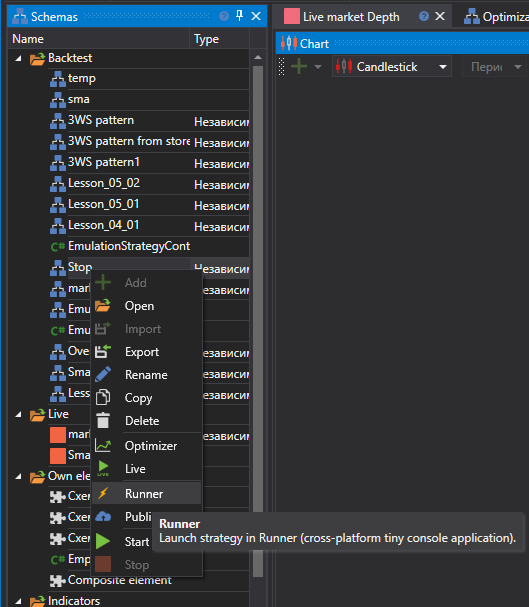

# Exportar a partir do Designer

O **Runner** permite executar estratégias criadas no [Designer](../designer.md). Esta é a forma mais conveniente de configurar o **Runner**, uma vez que todas as configurações são feitas visualmente.

Para exportar uma estratégia a partir do [Designer](../designer.md):

- Selecione a estratégia pretendida na árvore, clique nela com o botão direito e escolha o item de menu **Runner**:

  

- Na janela que aparece, é necessário selecionar que tipos de ligações devem ser exportados para o **Runner**, bem como as definições para gerir a estratégia através do [Telegram](../telegram_services.md):

  

Os seguintes ficheiros serão copiados para o diretório de exportação selecionado:

- connector.json - ficheiro que contém as definições de ligação
- params.json - ficheiro que contém os parâmetros da estratégia
- start.bat - ficheiro bat com uma linha de comandos já escrita para iniciar rapidamente o **Runner**
- strategy.json - ficheiro que contém a estratégia
- connector.json - ficheiro que contém as definições de ligação
- telegram.json - ficheiro que contém as definições de integração com o [Telegram](../telegram_services.md)
