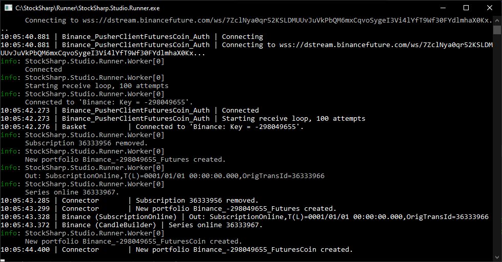
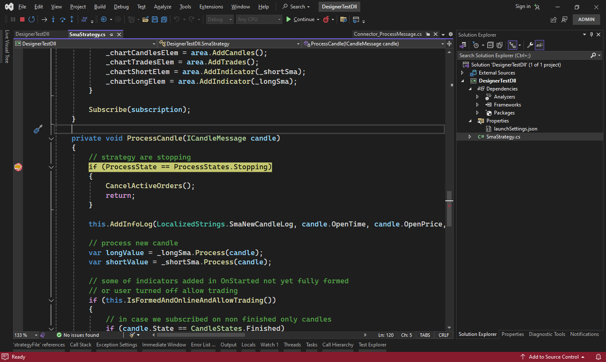

# Integração com o Visual Studio

O **Runner** pode ser usado como meio de depuração de estratégias de forma semelhante ao [Designer](../designer/strategies/using_dll/debug_dll_in_visual_studio.md). Isto é conveniente se estiver previsto executar a estratégia apenas no **Runner**. Caso contrário, é mais conveniente iniciar e trabalhar com a estratégia dentro do programa [Designer](../designer.md).

Para configurar o processo de depuração, é necessário realizar os seguintes passos:

1. Clique com o botão direito no projeto da estratégia de negociação e selecione **Propriedades** no menu de contexto:


No separador apresentado, encontre o item **Depurar**, selecione a secção **Geral** e clique em **Abrir interface de perfis de arranque de depuração**.

2. Em seguida, na janela que abre, crie um novo perfil de depuração com o lançamento de um programa externo:


3. Introduza o caminho completo para o **Runner** e especifique os parâmetros da linha de comandos para o lançamento. Mais sobre a [linha de comandos do Runner](command_line.md).


Argumentos da linha de comandos para o exemplo:

```cmd
l -s "$(TargetPath)" -c "C:\StockSharp\Runner\Data\connection.json" --sec BTCUSDT_PERPETUAL@BNB --pf Binance_-298049655_Futures
```

$(TargetPath) - é uma macro especial do **Visual Studio** que é automaticamente substituída pelo caminho para a DLL compilada com a estratégia durante o lançamento da depuração.

4. Feche a janela de definições do projeto e inicie a depuração do projeto (por exemplo, através de F5). A janela do programa **Runner** será apresentada, mostrando o processo de ligação de negociação:



5. Ao definir breakpoints, a execução do programa irá parar quando os atingir. Por exemplo, para depurar a lógica de negociação quando aparece uma nova vela:


