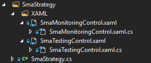

# Criar painel de estratégia

Os painéis personalizados são controlos especiais criados pela S# para facilitar o trabalho com elementos DevExpress.

Primeiro, precisa de criar um UserControl simples na pasta XAML da sua estratégia.




Substitua `UserControl` por `controls:BaseStudioControl`.

```xaml
<controls:BaseStudioControl>
...
</controls:BaseStudioControl>
	  				
```

Depois, implemente a lógica do seu próprio painel de forma semelhante aos painéis de estratégia existentes.

Para que o painel [Real-time](user_interface/real_time.md) veja a estratégia no seu painel, a sua estratégia deve ser definida como uma propriedade:

```cs
	public partial class SmaMonitoringControl
	{
	...
		public Strategy Strategy { get; set; }
	...
	}
		
```

Para guardar as definições da estratégia, deve substituir os métodos **Load** e **Save** no painel.

```cs
	public partial class SmaMonitoringControl
	{
	...
		public override void Load(SettingsStorage storage)
		{
			base.Load(storage);
			try
			{
				Strategy = MainWindow.Instance.CreateStrategy(storage.GetValue<SettingsStorage>(nameof(Strategy)));
				Init(Strategy);
			}
			catch (Exception e)
			{
				e.LogError();
			}
		}
		public override void Save(SettingsStorage storage)
		{
			base.Save(storage);
			storage.SetValue(nameof(Strategy), Strategy.Save());
		}
	...
	}
		
```

## Conteúdo recomendado

[Criar estratégia](create_strategy.md)
