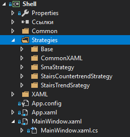
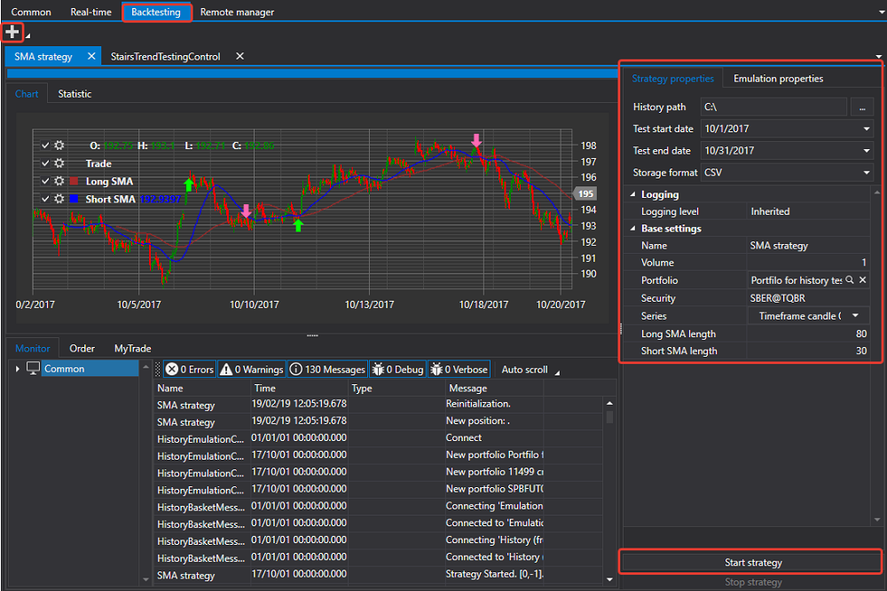

# Início rápido

O [Shell](../shell.md) é orientado para programação na linguagem [C#](https://en.wikipedia.org/wiki/C_Sharp_(programming_language)) no ambiente Visual Studio ou semelhante.

Quando inicia o projeto [Shell](../shell.md), o Solution Explorer apresenta o projeto Shell:

A pasta **Strategies** contém três estratégias incluídas no [Shell](../shell.md), uma shell para estratégias predefinidas, bem como algumas interfaces auxiliares.

O projeto pode ser iniciado sem qualquer preparação preliminar para ver como funciona com as estratégias já incluídas no [Shell](../shell.md).

Após o lançamento, veremos uma janela como esta:

As definições de ligação e os botões de ligação, bem como o botão para guardar a configuração atual do Shell, estão localizados na parte superior do ecrã. Os separadores principais também estão localizados aí.

Aceda às definições de ligação e selecione a ligação necessária. A forma de configurar uma ligação é descrita em [Definições de ligações](connections_settings.md).

O passo seguinte é ligar clicando no botão **Connect** .

Depois de ligar, no separador [Comum](user_interface/common.md), pode ver as carteiras, instrumentos, ordens e negócios próprios recebidos da ligação.

Aceda ao separador Real-time e clique no botão **Add**  para adicionar uma estratégia para negociação.

Depois de a estratégia ser adicionada, preencha os seus parâmetros básicos, como **Security**, **Portfolio**, etc. Clique no botão Start strategy para a iniciar.

De forma semelhante ao separador [Tempo real](user_interface/real_time.md), pode executar um teste de estratégia em dados históricos no separador [Emulação](user_interface/emulation.md).

