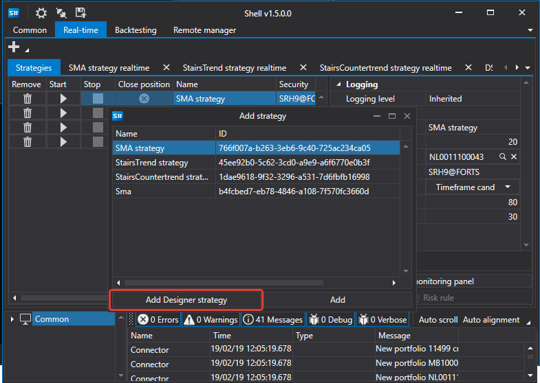

# Executar estratégias a partir do Designer

O [Shell](../shell.md) pode executar estratégias criadas no [Designer](../designer.md).

Para iniciar uma estratégia criada no [Designer](../designer.md), selecione-a no separador [Real-time](user_interface/real_time.md) e clique no botão **Add Designer strategy**. Na janela que aparece, escolha o ficheiro da estratégia exportado do [Designer](../designer.md).

Depois disso, ela aparecerá na lista de estratégias disponíveis.

Ao selecionar a estratégia adicionada, pode definir os parâmetros necessários e iniciá-la para negociação.

## Conteúdo recomendado

[Criar estratégia](create_strategy.md)
