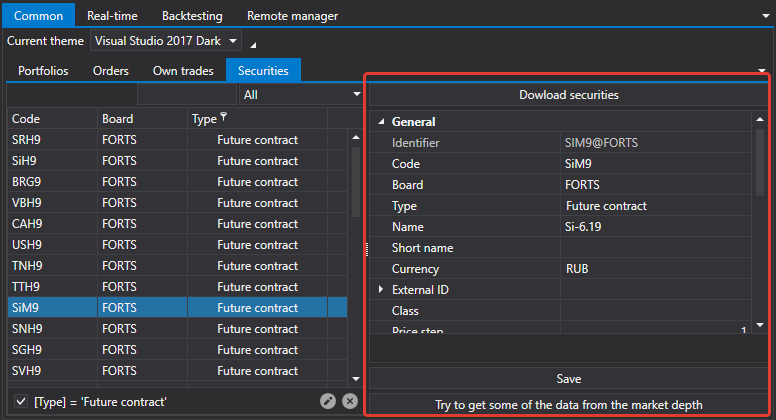

# Comum

O separador **Comum** permite-lhe ver informações gerais sobre carteiras, ordens, negócios e instrumentos. Aqui também pode definir o tema da interface do [Shell](../../shell.md).

No separador **Instrumentos**, pode carregar instrumentos a partir do armazenamento local e modificar as definições dos instrumentos.

## Conteúdo recomendado

[Tempo real](real_time.md)
