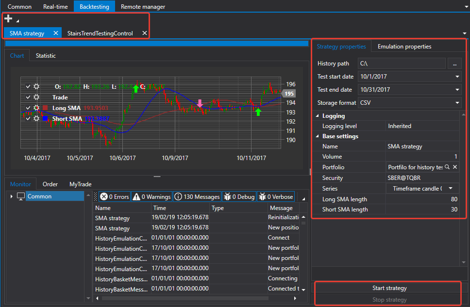

# Emulação

O separador **Emulação** permite-lhe testar estratégias em dados históricos.

Ao clicar no botão **Adicionar** , pode adicionar uma estratégia para teste. Cada estratégia adicionada é aberta num separador individual.

Um separador de estratégia individual contém informações extensas sobre a estratégia, estatísticas, uma lista de ordens registadas e negócios da estratégia, etc. Neste separador, pode configurar parâmetros de teste, o caminho para os dados históricos, as datas de início e fim do teste e o formato do armazenamento de dados históricos.

## Conteúdo recomendado

[RemoteManager](remotemanager.md)
