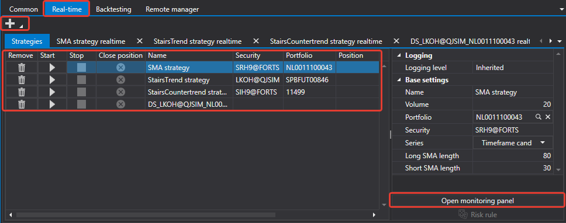

# Tempo real

O separador **Tempo real** permite-lhe gerir estratégias iniciadas em negociação.

Ao clicar no botão **Adicionar** , pode adicionar uma estratégia para iniciar a negociação. Cada estratégia adicionada é aberta num separador separado e adicionada à lista de estratégias no separador **Estratégias**.

No separador **Estratégias**, pode eliminar, iniciar, parar e configurar estratégias. O mesmo pode ser feito num separador de estratégia individual. O separador de estratégia individual contém informações mais extensas sobre a estratégia, estatísticas, uma lista de ordens registadas e negócios da estratégia, etc.

## Conteúdo recomendado

[Comum](common.md)
